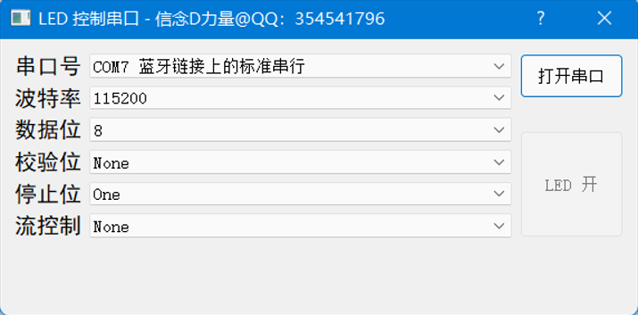

## dialog.h

```cpp
#ifndef DIALOG_H
#define DIALOG_H

#include <QDialog>
#include <QSettings>
#include <QSerialPort>
#include <QTimer>

QT_BEGIN_NAMESPACE
namespace Ui { class Dialog; }
QT_END_NAMESPACE

class Dialog : public QDialog
{
    Q_OBJECT

public:
    Dialog( QWidget *parent = nullptr );
    ~Dialog();

private:
    void getSerialNumber(void);
    void initSerial(void);
    void openSerial(void);
    void closeSerial(void);
    void initSetting(void);
    void initConnect(void);
    int parityBitStrToInt(QString s);
    int stopBitStrToInt(QString s);
    int flowControlStrToInt(QString s);
    void sendBytes(const QByteArray);


private:
    Ui::Dialog *ui;
    QSerialPort *serial1;

    QTimer *m_timerGetSerialNumber; /* 定时器 */

    QStringList m_serialNameList;
    QStringList *m_serialBaudRateList;
    QStringList *m_serialDataBitList;
    QStringList *m_serialParityList;
    QStringList	*m_serialStopBit;
    QStringList *m_SerialFlowControl;

    QString		m_settingFileName;          /* 配置文件名 */
    QSettings	*m_settingFileObj;          /* 配置文件 */

    QByteArray m_txBuffer;

    bool m_serialIsOpen;

private slots:
    void m_slotTimerGetSerialNumber(void);
    void m_slotCbSerialNumberActivated(int index);
    void m_slotCbBautActivated( int index );
    void m_slotCbDataBitActivated( int index );
    void m_slotCbParityBitActivated(int index);
    void m_slotCbStopBitActivated(int index);
    void m_slotCbFlowControlActivated(int index);
    void m_slotOpenSerial(bool);
    void m_slotOpenLED(bool);

};
#endif /* DIALOG_H */

```


## dialog.c

```cpp
#include "dialog.h"
#include "ui_dialog.h"
#include <QSerialPort>
#include <QSerialPortInfo>
#include <QtDebug>
#include <vector>
#include <QDir>


/**
 * @brief Dialog::Dialog 构造函数
 * @param parent
 */
Dialog::Dialog(QWidget *parent)
    : QDialog(parent), ui(new Ui::Dialog)
{
    ui->setupUi(this);

    getSerialNumber(); /* 获取串口号 */
    initConnect();
    initSetting(); /* 初始化配置信息 */
    initSerial();  /* 串口初始化 */
}

/**
 * @brief Dialog::~Dialog 析构函数
 */
Dialog::~Dialog()
{
    delete ui;
}

/**
 * @brief Dialog::getSerialNumber
 * @brief 获取所有串口端口号
 */
void Dialog::getSerialNumber()
{
    /* 实例化定时器 */
    m_timerGetSerialNumber = new QTimer(this);
    m_timerGetSerialNumber->stop();
    m_timerGetSerialNumber->setInterval(6000);

    foreach (const QSerialPortInfo &info, QSerialPortInfo::availablePorts())
    {
        m_serialNameList.push_back(info.portName() + " " + info.description());
    }
    m_timerGetSerialNumber->start();
}

/**
 * @brief Dialog::initSerial 串口初始化
 */
void Dialog::initSerial()
{
    /* 波特率下拉列表初始化 */
    m_serialBaudRateList = new QStringList({ "300", "600", "1200", "2400", "4800", "9600", "14400", "19200", "38400", "56000", "57600", "115200",
                                        "128000", "256000", "460800", "512000", "750000", "921600", "1500000"});
    ui->cb_Baud->addItems(*m_serialBaudRateList);

    /* 数据位下拉列表初始化 */
    m_serialDataBitList = new QStringList({"5", "6", "7", "8"});
    ui->cb_DataBit->addItems(*m_serialDataBitList);

    /* 校验位下拉列表初始化 */
    m_serialParityList = new QStringList({"None", "Even", "Odd", "Space", "Mark", "Unknown"});
    ui->cb_ParipyBit->addItems(*m_serialParityList);

    /* 停止位下拉列表初始化 */
    m_serialStopBit = new QStringList({"One", "OnePointFive", "Two"});
    ui->cb_StopBit->addItems(*m_serialStopBit);

    /* 流控制下拉列表初始化 */
    m_SerialFlowControl = new QStringList({"None", "HardwareControl", "SoftwareControl"});
    ui->cb_FlowControl->addItems(*m_SerialFlowControl);


    /* 串口号载入到 ComboBox */
    ui->cb_SerialNum->addItems(m_serialNameList);

    /* 设置下拉列表默认值 - 从配置文件中读取 */
    m_settingFileObj->beginGroup("serial");
    ui->cb_SerialNum->setCurrentText(m_settingFileObj->value("serial_number").toString());
    ui->cb_Baud->setCurrentText(m_settingFileObj->value("baud_rate").toString());
    ui->cb_DataBit->setCurrentText(m_settingFileObj->value("data_bit_length").toString());
    ui->cb_ParipyBit->setCurrentText(m_settingFileObj->value("parity_bit").toString());
    ui->cb_StopBit->setCurrentText(m_settingFileObj->value("stop_bit").toString());
    ui->cb_FlowControl->setCurrentText(m_settingFileObj->value("flow_control").toString());
    m_settingFileObj->endGroup();
    m_settingFileObj->sync();
}

void Dialog::openSerial()
{
    serial1 = new QSerialPort();
    m_settingFileObj->beginGroup("serial");
    QString serial_name = m_settingFileObj->value("serial_number").toString();
    qint32 serial_baud_rate = m_settingFileObj->value("baud_rate").toInt();
    QSerialPort::DataBits data_bit = (QSerialPort::DataBits)m_settingFileObj->value("serial_data_length").toInt();
    QSerialPort::Parity parity_bit = (QSerialPort::Parity)parityBitStrToInt(m_settingFileObj->value("parity_bit").toString());
    QSerialPort::StopBits stop_bit = (QSerialPort::StopBits)stopBitStrToInt(m_settingFileObj->value("stop_bit").toString());
    QSerialPort::FlowControl flow_control = (QSerialPort::FlowControl)flowControlStrToInt(m_settingFileObj->value("flow_control").toString());
    m_settingFileObj->endGroup();
    QString serial_t = serial_name.left(serial_name.indexOf(" ")); /* 从串口字符串中提取出串口名字，如：COM1, COM2等 */
    qDebug() << "串口最终名字" << serial_t;
    serial1->setPortName(serial_t);

    m_serialIsOpen = serial1->open(QIODevice::ReadWrite);
    if(m_serialIsOpen){
        serial1->setBaudRate(serial_baud_rate);
        serial1->setDataBits(data_bit);
        serial1->setParity(parity_bit);
        serial1->setStopBits(stop_bit);
        serial1->setFlowControl(flow_control);
        ui->pbtn_LEDSwitch->setEnabled(true);
    }

    qDebug() << serial_name << serial_baud_rate << data_bit << parity_bit << stop_bit << flow_control;
}

/**
 * @brief 关闭串口
 */
void Dialog::closeSerial()
{
    serial1->clear();
    serial1->close();
    serial1->deleteLater();
    ui->pbtn_LEDSwitch->setEnabled(false);
}

/**
 * @brief 初始化设置
 */
void Dialog::initSetting()
{
    m_settingFileName = QDir::currentPath() + "/setting.ini";
    qDebug() << m_settingFileName;
    m_settingFileObj = new QSettings(m_settingFileName, QSettings::IniFormat);
    m_settingFileObj->setIniCodec("UTF-8");
}

/**
 * @brief 初始化信号和槽函数的连接
 */
void Dialog::initConnect()
{
    /* LED 开关 */
    connect(ui->pbtn_LEDSwitch, SIGNAL(clicked(bool)), this, SLOT(m_slotOpenLED (bool)));

    /* 打开串口按钮 */
    connect(ui->pbtn_openSerial, SIGNAL(clicked(bool)), this, SLOT(m_slotOpenSerial(bool)));

    /* 串口号下拉列表 */
    connect(ui->cb_SerialNum, SIGNAL(activated(int)), this, SLOT(m_slotCbSerialNumberActivated(int)));
    /* 波特率下拉列表信号连接 */
    connect(ui->cb_Baud, SIGNAL(activated(int)), this, SLOT(m_slotCbBautActivated(int)));

    /* 数据位下拉列表*/
    connect(ui->cb_DataBit, SIGNAL(activated(int)), this, SLOT(m_slotCbDataBitActivated(int)));

    /* 校验位下拉列表 */
    connect(ui->cb_ParipyBit, SIGNAL(activated(int)), this, SLOT(m_slotCbParityBitActivated(int)));

    /* 停止位下拉列表 */
    connect(ui->cb_StopBit, SIGNAL(activated(int)), this, SLOT(m_slotCbStopBitActivated(int)));

    /*  流控制下拉列表 */
    connect(ui->cb_FlowControl, SIGNAL(activated(int)), this, SLOT(m_slotCbFlowControlActivated (int)));

    /* 获取串口定时器 */
    connect(m_timerGetSerialNumber, SIGNAL(timeout()), this, SLOT(m_slotTimerGetSerialNumber()));
}

/**
 * @brief 停止位字符串转换为对应的整数
 * @param s
 * @return
 */
int Dialog::stopBitStrToInt(QString s)
{
    int t = 0;
    if(s == "One") t = 1;
    else if(s == "Two") t = 2;
    else if(s == "OnePointFive") t = 3;
    else t = -1;
    return t;
}

/**
 * @brief 流控制字符串转换为对应的整数
 * @param s
 * @return
 */
int Dialog::flowControlStrToInt(QString s)
{
    int t = 0;
    if(s == "None") t = 0;
    else if(s == "HardwareControl") t = 1;
    else if(s == "SoftwareControl") t = 2;
    else t = -1;
    return t;
}

/**
 * @brief 串口发送数据
 * @param data
 */
void Dialog::sendBytes(const QByteArray data)
{
    serial1->write(data);
    serial1->waitForBytesWritten();
}

/**
 * @brief 校验位字符串转换为对应的整数
 * @param s
 * @return
 */
int Dialog::parityBitStrToInt(QString s)
{
    int t = 0;
    if(s == "None") t = 0;
    else if(s == "Even") t = 2;
    else if(s == "Odd") t = 3;
    else if(s == "Space") t = 4;
    else if(s == "Mark") t = 5;
    else t = -1;
    return t;
}

/**
 * @brief Dialog::m_slotTimerGetSerialNumber
 * @brief 在定时器中判断当前串口是否存在
 */
void Dialog::m_slotTimerGetSerialNumber()
{
    QString m_currentText;
    QStringList sltemp;
    foreach (const QSerialPortInfo &info, QSerialPortInfo::availablePorts())
    {
        sltemp.append(info.portName() + " " + info.description());
    }

    QList<QString>::iterator it;
    for(it=m_serialNameList.begin(); it!= m_serialNameList.end(); it++)
    {
        /* it 不在 sltemp，说明当前串口列表中的该元素以不存在 */
        if(!sltemp.contains(*it))
        {
            qDebug() << "串口不存在";
        }
        /* it为不存在的串口，让m_currentText 等于等于当前下拉列表值 */
        if(*it != ui->cb_SerialNum->currentText())
        {
            m_currentText = ui->cb_SerialNum->currentText(); /* 保存当前下拉列表的索引值 */
        }
    }

    m_serialNameList.clear(); /* 清空整个容器,然后给该容器追加新元素 */
    for(QList<QString>::iterator it=sltemp.begin(); it!=sltemp.end(); it++){
        m_serialNameList.push_back(*it);
    }
    m_serialNameList = sltemp;
    ui->cb_SerialNum->clear();
    ui->cb_SerialNum->addItems(m_serialNameList);
    ui->cb_SerialNum->setCurrentText(m_currentText); // 设置当前值
    sltemp.clear();
}

/**
 * @brief Dialog::m_slotCbSerialNumberActivated
 * @param index
 */
void Dialog::m_slotCbSerialNumberActivated(int index)
{
    qDebug() << "当前串口号" << m_serialNameList[index];
    m_settingFileObj->beginGroup("serial");
    m_settingFileObj->setValue("serial_number", m_serialNameList[index]);
    m_settingFileObj->endGroup();
    m_settingFileObj->sync();
}

/**
 * @brief Dialog::slotCbBaut_activated
 * @brief 波特率下拉列表当前索引
 * @param index
 */
void Dialog::m_slotCbBautActivated(int index)
{
    qDebug() << "mSerialBaudRate=" << (*m_serialBaudRateList)[index];
    m_settingFileObj->beginGroup("serial");
    m_settingFileObj->setValue("baud_rate", (*m_serialBaudRateList)[index]);
    m_settingFileObj->endGroup();
    m_settingFileObj->sync();
}

/**
 * @brief Dialog::m_slotCbDataBitActivated
 * @param index
 */
void Dialog::m_slotCbDataBitActivated(int index)
{
    qDebug() << "当前串口数据位" << (*m_serialDataBitList)[index];
    m_settingFileObj->beginGroup("serial");
    m_settingFileObj->setValue("data_bit_length", (*m_serialDataBitList)[index]);
    m_settingFileObj->endGroup();
    m_settingFileObj->sync();
}

/**
 * @brief Dialog::m_slotCbParityBitActivated
 * @param index
 */
void Dialog::m_slotCbParityBitActivated(int index)
{
    qDebug() << "当前串口校验位" << (*m_serialParityList)[index];
    m_settingFileObj->beginGroup("serial");
    m_settingFileObj->setValue("parity_bit", (*m_serialParityList)[index]);
    m_settingFileObj->endGroup();
    m_settingFileObj->sync();
}

/**
 * @brief Dialog::m_slotCbStopBitActivated
 * @param index
 */
void Dialog::m_slotCbStopBitActivated(int index)
{
    qDebug() << "当前串口停止位" << (*m_serialStopBit)[index];
    m_settingFileObj->beginGroup("serial");
    m_settingFileObj->setValue("stop_bit", (*m_serialStopBit)[index]);
    m_settingFileObj->endGroup();
    m_settingFileObj->sync();
}

void Dialog::m_slotCbFlowControlActivated(int index)
{
    qDebug() << "当前串口流控制" << (*m_SerialFlowControl)[index];
    m_settingFileObj->beginGroup("serial");
    m_settingFileObj->setValue("flow_control", (*m_SerialFlowControl)[index]);
    m_settingFileObj->endGroup();
    m_settingFileObj->sync();
}

/**
 * @brief 打开串口
 * @param state
 */
void Dialog::m_slotOpenSerial(bool state)
{
    if(state){
        openSerial();
        qDebug() << "串口已打开";
    } else {
        closeSerial();
        qDebug() << "串口已关闭";
    }
}

/**
 * @brief 按钮槽函数：控制单片机LED亮灭
 * @param state
 */
void Dialog::m_slotOpenLED(bool state)
{
    m_txBuffer.resize(50);

    if(state){
        m_txBuffer.clear();
        m_txBuffer.append("LED_ON#");
        sendBytes(m_txBuffer);
        qDebug() << "LED已打开";
        ui->widget_led->setStyleSheet("background: red");
    } else {
        m_txBuffer.clear();
        m_txBuffer.append("LED_OFF#");
        sendBytes(m_txBuffer);
        qDebug() << "LED已关闭";
        ui->widget_led->setStyleSheet("background: white");
    }
}


```


