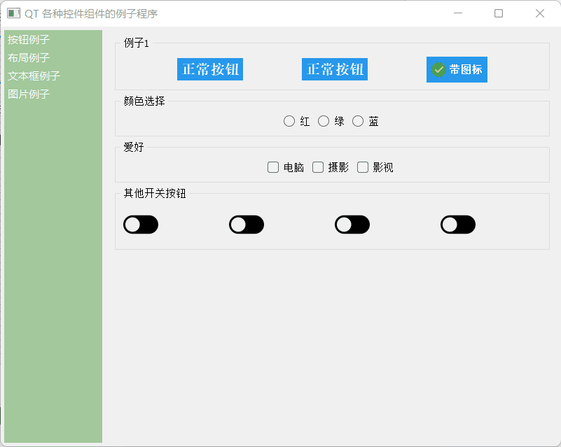

## 1. 添加一个 QCheckBox 控件

## 2. 在右侧属性栏的styleSheet添加如下代码

```css
QCheckBox::indicator {
	width: 50px;
	height: 50px;
}

QCheckBox::indicator:checked {
	image: url(':/images/images/switch-on.png');
}

QCheckBox::indicator:unchecked {
	image: url(':/images/images/switch-off.png');
}
```

效果如下：



