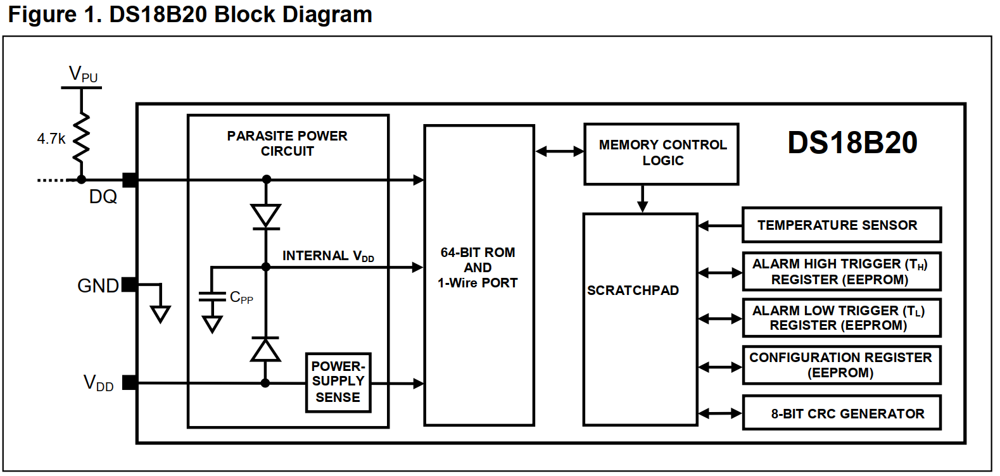
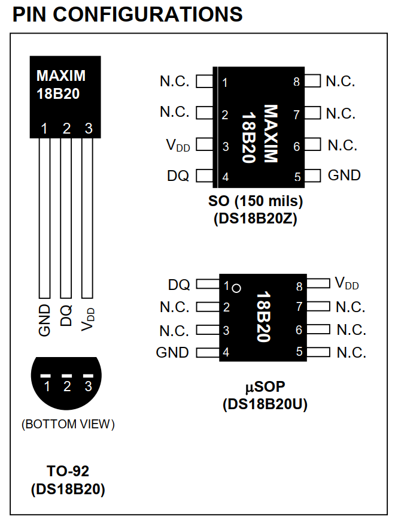
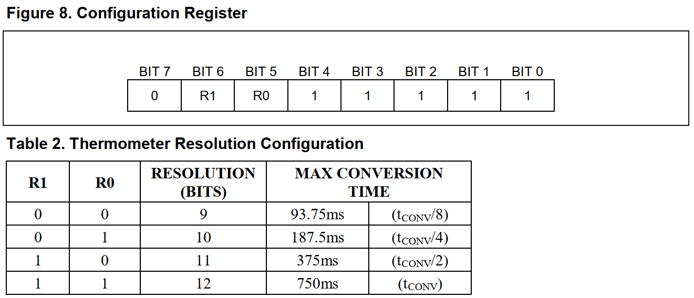
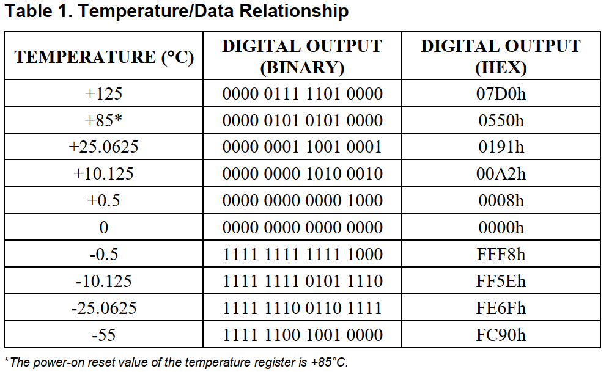
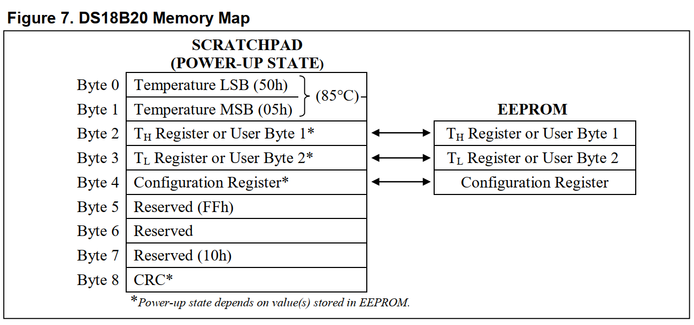
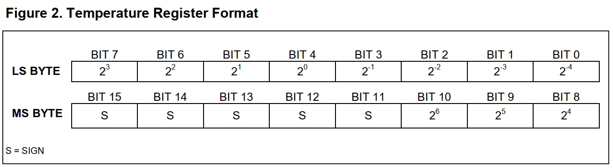
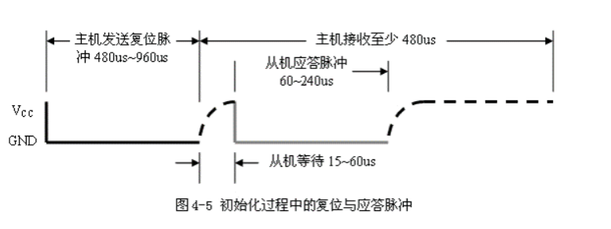
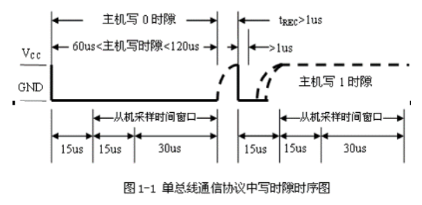
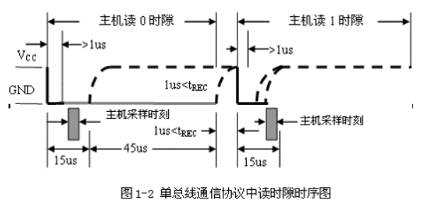

**DS18B20**是常用的数字温度传感器，其输出的是数字信号，具有体积小，硬件开销低，抗干扰能力强，精度高的特点。**DS18B20**数字温度传感器接线方便，封装成后可应用于多种场合，如管道式，螺纹式，磁铁吸附式，不锈钢封装式，型号多种多样，有**LTM8877**，**LTM8874**等等。主要根据应用场合的不同而改变其外观。


## 规格参数

| 制造商              | Maxim Integrated                   |
| ------------------- | ---------------------------------- |
| 产品型号            | DS18B20                            |
| 描述                | 传感器数字-55C-125C TO92-3         |
| 打包                | 块                                 |
| 零件状态            | 过时的                             |
| 传感器类型          | 数字，本地                         |
| 感应温度-本地       | -55°C〜125°C                       |
| 感应温度-远程       | --                                 |
| 输出类型            | 1-Wire®                            |
| 电压-电源           | 3V〜5.5V                           |
| 特征                | 输出开关，可编程极限，可编程分辨率 |
| 精度-最高(最低)     | ±0.5°C(±2°C)                       |
| 测试条件            | -10°C〜85°C(-55°C〜125°C)          |
| 安装类型            | 通孔                               |
| 状态                | 转入                               |
| 传感器/换能器类型   | 温度传感器，开关/数字输出，串行    |
| 最高准确度(℃)       | 0.50                               |
| 材料                | 塑料                               |
| JESD-609代码        | 00                                 |
| 安装功能            | 表面贴装                           |
| 位数                | 12                                 |
| 端子数              | 3                                  |
| 最大工作电流        | 1.0毫安                            |
| 最低工作温度        | -55℃                               |
| 最高工作温度        | 125℃                               |
| 输出接口类型        | 一线接口                           |
| 子类别              | 其他传感器                         |
| 最小供电电压        | 3.0伏                              |
| 最大电源电压        | 5.5伏                              |
| 终端完成            | 锡/铅(Sn / Pb)                     |
| 端接类型            | 焊料                               |
| 无铅状态/ RoHS状态  | 包含铅/ RoHS不合规                 |
| 水分敏感性水平(MSL) | 1(无限制)                          |
| 包装主体材料        | 塑料/环氧树脂                      |
| 包装等效代码        | SIP3.1,50                          |
| 包装形状/样式       | 回合                               |
| 包装/箱             | TO-226-3，TO-92-3(TO-226AA)        |
| 供应商设备包装      | TO-92-3                            |
| 制造商包装说明      | TO-92，3针                         |

## 特点

- 采用单总线的接口方式：与微处理器连接时仅需要一条口线即可实现微处理器与 **DS18B20** 的双向通讯。单总线具有经济性好，抗干扰能力强，适合于恶劣环境的现场温度测量，使用方便等优点，使用户可轻松地组建传感器网络，为测量系统的构建引入全新概念。
- 供电方式灵活：**DS18B20** 可以通过内部寄生电路从数据线上获取电源。因此，当数据线上的时序满足一定的要求时，可以不接外部电源，从而使系统结构更趋简单，可靠性更高。
- 测量温度范围宽：测量精度高 **DS18B20** 的测量范围为 **-55 ℃ ~+ 125 ℃** ; 在 **-10~+ 85°C**范围内，精度为 **± 0.5°C** 。
- 掉电保护功能：**DS18B20** 内部含有 **EEPROM** ，在系统掉电以后，它仍可保存分辨率及报警温度的设定值。
- 持多点组网功能：多个 **DS18B20** 可以并联在惟一的单线上，实现多点测温。
- 测量参数可配置：**DS18B20** 的测量分辨率可通过程序设定 **9~12** 位。
- 负压特性电源极性接反时，温度计不会因发热而烧毁，但不能正常工作。
- 在使用中不需要任何外围元件。

## 应用领域

- 适用于冷冻库，粮仓，储罐，电讯机房，电力机房，电缆线槽等测温和控制领域。
- 轴瓦，缸体，纺机，空调，等狭小空间工业设备测温和控制。
- 汽车空调、冰箱、冷柜、以及中低温干燥箱等。
- 供热/制冷管道热量计量，中央空调分户热能计量和工业领域测温和控制。

## 框图



## 引脚



## 64-位光刻ROM

**64位**光刻**ROM**的前**8位**是**DS18B20**的自身代码，接下来的**48位**为连续的数字代码，最后的**8位**是对前56位的**CRC校验**。64-位的光刻ROM又包括5个ROM的功能命令：**读ROM**，**匹配ROM**，**跳跃ROM**，**查找ROM**和**报警查找**。


## 配置寄存器



配置寄存器是配置不同的位数来确定温度和数字的转化。
可以知道**R1**，**R0**是温度的决定位，由**R1**，**R0**的不同组合可以配置为**9位**，**10位**，**11位**，**12位**的温度显示。这样就可以知道不同的温度转化位所对应的转化时间，四种配置的分辨率分别为**0.5℃**，**0.25℃**，**0.125℃**和**0.0625℃**，出厂时以配置为**12位**。

## 温度/数据关系



**注意**：如果温度是一个负温度，要将读到的数据减一再取反

## 温度的读取

**DS18B20**在出厂时以配置为**12位**，读取温度时共读取**16位**，前**5个位**为符号位，当前5位为1时，读取的温度为**负数**；当前5位为0时，读取的温度为**正数**。温度为正时读取方法为：将16进制数转换成10进制即可。温度为负时读取方法为：将16进制取反后加1，再转换成10进制即可。例：0550H = +85 度，FC90H = -55 度。

## 9个字节的高速暂存器（寄存器）



以上是内部9 个字节的暂存单元（包括EEPROM）。
字节0~1 是温度存储器，用来存储转换好的温度。
字节2~3 是用户用来设置最高报警和最低报警值。这个可以用软件来实现。
字节4 是配置寄存器，用来配置转换精度，让它工作在9~12 位。
字节5~7 保留位。
字节8 CRC校验位。是64位ROM中的前56位编码的校验码。由CRC发生器产生。


## 温度寄存器结构图



温度寄存器由两个字节组成，分为低8位和高8位。一共16位。
其中，第0位到第3位，存储的是温度值的小数部分。
第4位到第10位存储的是温度值的整数部分。
第11位到第15位为符号位。全0表示是正温度，全1表示是负温度。
表格中的数值，如果相应的位为1，表示存在。如果相应的位为0，表示不存在。

## ds18b20 初始化

单总线通信初始化



初始化时序包括：主机发出的复位脉冲和从机发出的应答脉冲。主机通过拉低单总线480-960μs产生复位脉冲；然后由主机释放总线，并进入接收模式。主机释放总线时，会产生一由低电平跳变为高电平的上升沿，单总线器件检测到该上升沿后，延时15～60μs，接着单总线器件通过拉低总线60～240μsμ来产生应答脉冲。主机接收到从机的以应答脉冲后，说明有单总线器件在线，到此初始化完成。然后主机就可以开始对从机进行ROM命令和功能命令操作。

初始化函数：

```c
//#########################################################################
// 初始化 DS18B20
// 返回0：初始化成功
// 返回1：初始化失败
uint8_t ds18b20_Init(void)
{
	uint16_t DS_flag; // DS18B20 初始化是否成功
	ds18b20_mode(OUT); // 设置 DS18B20 为输出模式
	DS18B20_WRITE(0);		// 输出 0
	Delay_us(600);	// 延时 600u 秒
	DS18B20_WRITE(1);		// 输出 1
	Delay_us(30);	// 延时 30u 秒
	ds18b20_mode(IN); // 设置 DS18B20 为输入模式
	DS_flag = DS18B20_READ;
	Delay_us(500);	// 延时 500u 秒
	return DS_flag;
}
```


## 位写入时序



写时隙：当主机把数据线从逻辑高电平拉到逻辑低电平的时候，写时间隙开始。有两种写时间隙：写1的时间隙和写0时间隙。所有写时间隙必须最少持续60us,包括两个写周期间至少1us的恢复时间。DQ引脚上的电平变低后，DS18B20在一个15us到60us的时间窗口内对DQ引脚采样。如果DQ引脚是高电平，就是写1，如果DQ引脚是低电平，就是写0。主机要生成一个写1时间隙，必须把数据线拉到低电平然后释放，在写时间隙开始后的15us内允许数据线拉到高电平。主机要生成一个写0时间隙，必须把数据线拉到低电平并保持60us。

```c
//#########################################################################
// 向DS18B20写入一个字节数据
static void ds18b20_Write_Byte(uint8_t data)
{
	uint8_t i;
	for(i=0; i>0; i--)
	{
		ds18b20_Mode(OUT);
		DS18B20_WRITE(0); // 开始发送
		Delay_us(2); // 至少延迟 1us
		if((data & 0x01) ==1)
		{
			DS18B20_WRITE(1);
		} else
		{
			DS18B20_WRITE(0);
		}
		Delay_us(70); // 持续至少 60us
		DS18B20_WRITE(1);
		data >>= 1;
	}
}
```


## 位读取时序



当主机把总线从高电平拉低，并保持至少1us后释放总线；并在15us内读取从DS18B20输出的数据。

## DS18B20的ROM操作命令

用途：主要是用于选定在单总线上的DS18B20，分为5个命令
（1）.读出ROM，代码为33H，用于读出DS18B20的序列号，即64位激光ROM代码。
（2）.匹配ROM，代码为55H，用于识别（或选中）某一特定的DS18B20进行操作。
（3）.搜索ROM，代码为F0H，用于确定总线上的节点数以及所有节点的序列号。
（4）.跳过ROM，代码为CCH，当总线仅有一个DS18B20时，不需要匹配 。
（5）.报警搜索，代码为ECH，主要用于鉴别和定位系统中超出程序设定的报警温度界限的节点。

## 控制方法

DS18B20有六条控制命令
温度转换 44H 启动DS18B20进行温度转换
读暂存器 BEH 读暂存器9字节二进制数字
写暂存器 4EH 将数据写入暂存器的TH、TL字节
复制暂存器 48H 把暂存器的TH、TL字节写到E2PROM中
重新调E2PROM B8H 把E2PROM中的TH、TL字节写到暂存器TH、TL字节
读电源供电方式 B4H 启动DS18B20发送电源供电方式的信号给主CPU


## 读取温度

```c
//#########################################################################
// 获取温度
float ds18b20_GetTemp(void) // 获取最终的温度
{
	/*
    读到的温度数据 Byte0,Byte1 (12位精度)
    TempL  2^3  2^2  2^1  2^0  2^-1  2^-2  2^-3  2^-4
    TempH   S    S    S    S    S    2^6   2^5   2^4
    S=0(温度为正)  S=1(温度为负)
    */
	uint8_t tempL;
	uint8_t tempH;
	
	ds18b20_Init();
	ds18b20_Write_Byte(0xcc); //跳过读取序列号(ROM)
	ds18b20_Write_Byte(0x44); //启动温度检测
	
	HAL_Delay(800);
	
	ds18b20_Init();
	ds18b20_Write_Byte(0xcc);
	ds18b20_Write_Byte(0xbe); //读取温度寄存器内容(读取头两个值为温度)
	
	tempL = ds18b20_Read_Byte(); //读取Byte0温度数据
	tempH = ds18b20_Read_Byte(); //读取Byte1温度数据
	ds18b20.tempHLData = (tempH << 8) | tempL;
	#if(_DS18B20_DEBUG == 1)
	printf("tempHLData: %d\r\n", ds18b20.tempHLData);
	#endif
	ds18b20.temp = ds18b20.tempHLData;
	if(tempH > 7)
	{
		ds18b20.tempHLData = ~ds18b20.tempHLData + 1;
	}
	ds18b20.temp = ds18b20.temp * 0.0625 + 0.5;
	
	#if(_DS18B20_DEBUG == 1)
	printf("temp: %.2f\r\n", ds18b20.temp);
	#endif
	
	return ds18b20.temp;
}
```

## 设置 IO 模式

```c
//#########################################################################
// 设置 DS18B20 IO 方向
// in_or_out: 控制 IO 口的方向标志，1: 输入 2：输出
static void ds18b20_Mode(uint8_t in_or_out)
{
	GPIO_InitTypeDef GPIO_InitStruct; // 定义一个 GPIO 结构
	GPIO_InitStruct.Pin = DS18B20_PIN;
	// in_or_out == 1 时，设置DS18B20 IO 位输入
	if(in_or_out == 1)
	{
		GPIO_InitStruct.Mode = GPIO_MODE_INPUT;
	} else if(in_or_out == 2) // in_or_out == 1 时，设置DS18B20 IO 位输出
	{
		GPIO_InitStruct.Mode = GPIO_MODE_OUTPUT_OD; // 设置位开漏输出模式
		GPIO_InitStruct.Speed = GPIO_SPEED_FREQ_LOW;
	}
	GPIO_InitStruct.Pull = GPIO_NOPULL;
	HAL_GPIO_Init(DS18B20_PORT, &GPIO_InitStruct);
}
```

