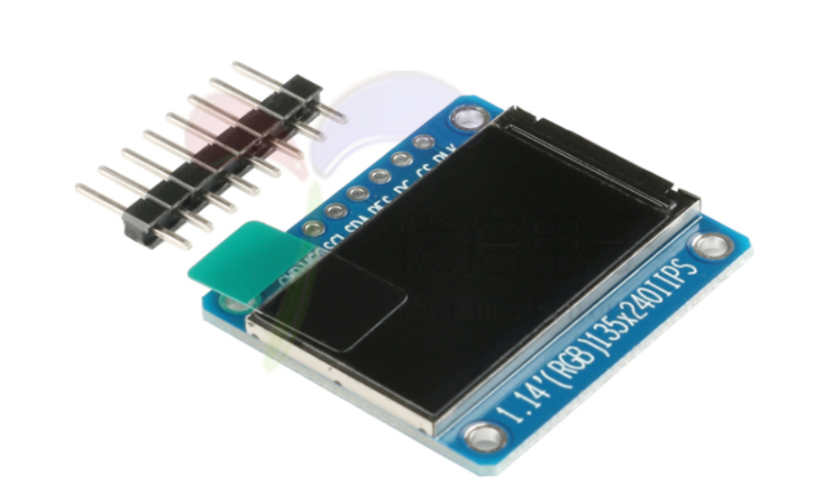
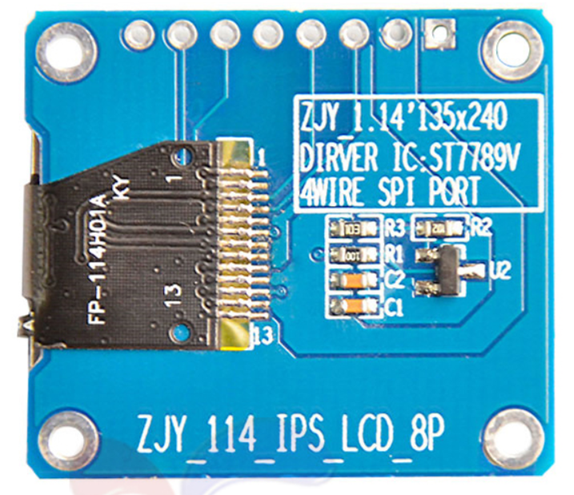
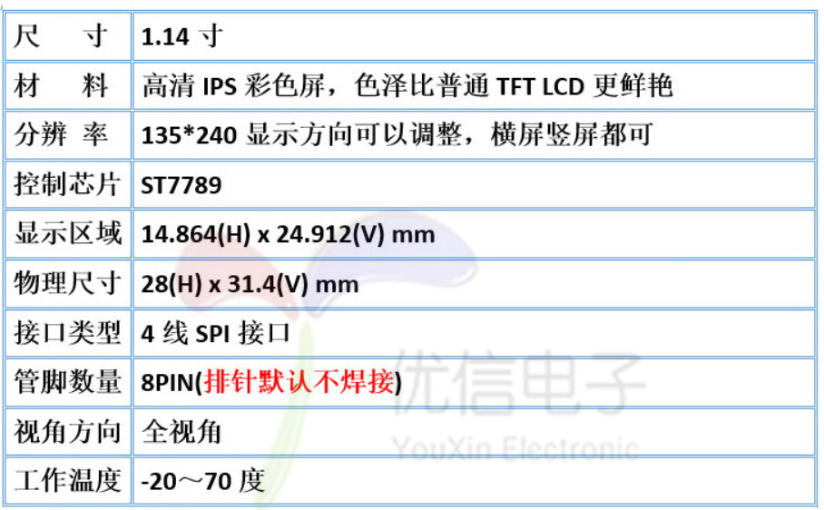
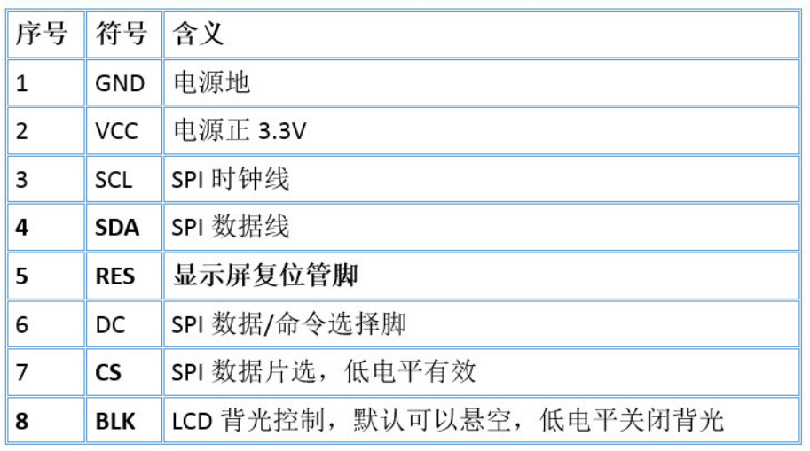
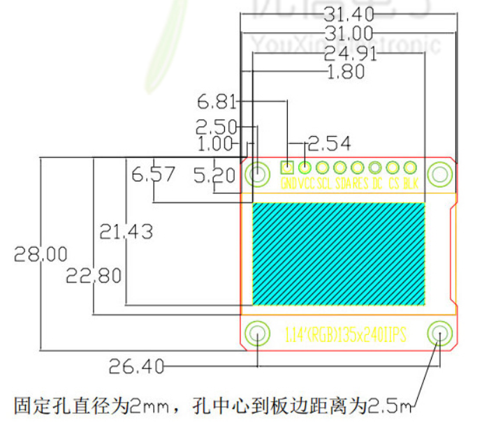

ST7789 TFT 屏驱动芯片。

本文以 1.14寸TFT显示屏为例来学习该屏幕的驱动。

## 屏幕外观

## 产品介绍

## 接口定义

### RES 复位引脚

复位引脚低电平有效，平常为高电平

### CS 片选信号

CS 片选信号低电平使能，高电平禁能

### DC SPI 数据/命令选择管脚

0：命令

1： 数据

### BLK 背光控制

BLK 默认可以悬空（为打开状态）

0：关闭背光

1：打开背光

## 产品结构

## ST7789

==**ST7789VW**==是一个单片控制器/驱动器的262K彩色，图形类型的TFT-LCD。它由720条源线和320栅极线驱动电路组成。该芯片能够直接连接到外部微处理器，并接受8位/9位/16位/18位并行接口。显示数据可以存储在240x320x18位的芯片上显示数据RAM中。可在没有外部操作时钟的情况下执行显示数据内存读写操作，以尽量降低功耗。此外，由于驱动液晶所需要的集成电源电路，可以制造具有最少部件的显示系统。

### 特性

* Single chip TFT-LCD Controller/Driver with On-chip Frame Memory (FM) 
* Display Resolution: 240*RGB (H) *320(V) 
*  Frame Memory Size: 240 x 320 x 18-bit = 1,382,400 bits 
* LCD Driver Output Circuits 
  * Source Outputs: 240 RGB Channels 
  * Gate Outputs: 320 Channels 
  *  Common Electrode Output 
* Display Colors (Color Mode) 
  * Full Color: 262K, RGB=(666) max., Idle Mode Off 
  * Color Reduce: 8-color, RGB=(111), Idle Mode On 
* Programmable Pixel Color Format (Color Depth) for Various Display Data input Format 
  * 12-bit/pixel: RGB=(444) 
  * 16-bit/pixel: RGB=(565) 
  * 18-bit/pixel: RGB=(666) 
* MCU Interface 
  * Parallel 8080-series MCU Interface (8-bit, 9-bit, 16-bit & 18-bit) 
  * 6/16/18 RGB Interface(VSYNC, HSYNC, DOTCLK, ENABLE, DB[17:0]) 
  * Serial Peripheral Interface(SPI Interface) 
  * VSYNC Interface 
* Display Features 
  * Programmable Partial Display Duty  | 可编程的部分显示功能
  * CABC for saving current consumption  | 可节省电流消耗量的CABC
  * Color enhancement  | 彩色增强
* On Chip Build-In Circuits  | 关于芯片内置电路的研究
  * DC/DC Converter | 直流/直流转换器
  * Adjustable VCOM Generation 
  * Non-Volatile (NV) Memory to Store Initial Register Setting and Factory Default Value (Module ID, Module Version, etc)  | 要存储初始寄存器设置和出厂默认值的非挥发性(NV)内存（模块ID、模块版本等）
  * Timing Controller 
  *  4 preset Gamma curve with separated RGB Gamma setting 
* Build-In NV Memory for LCD Initial Register Setting  | LCD初始寄存器设置的内置NV内存
  * 8-bits for ID1 setting 
  * 8-bits for ID2 setting
  * 8-bits for ID3 setting 
  * 6-bits for VCOM Offset adjustment
* Driving Algorithm | 驱动算法
  * Dot Inversion  | 点反转
  * Column Inversion | 列倒置
* Wide Supply Voltage Range |电源电压范围较广
  * I/O Voltage (VDDI to DGND): 1.65V ~ 3.3V (VDDI VDD) |输入/输出电压（VDDI至DGND）：1.65V~3.3V(VDDIVDD)
  * Analog Voltage (VDD to AGND): 2.4V ~ 3.3V |模拟电压（VDD至AGND）：2.4V~3.3V
* On-Chip Power System |片上电源系统
  * Source Voltage (VAP (GVDD) to VAN (GVCL)): +6.4~-4.6V |源电压（VAP(GVDD)至VAN(GVCL)）：+6.4~-4.6V
  * VCOM level: GND (VCOM级别：GND)
  * Gate driver HIGH level (VGH to AGND): +12.2V ~ +14.97V | 闸门驱动器高等级（VGH至AGND）：+12.2V~+14.97V
  * Gate driver LOW level (VGL to AGND): -12.5V ~ -7.16V | 闸门驱动器低电平（VGL至AGND）：-12.5V~-7.16V
* Optimized layout for COG Assembly 
* Operate temperature range: −30℃ to +85℃  |工作温度范围
* Lower Power Consumption |低功耗

