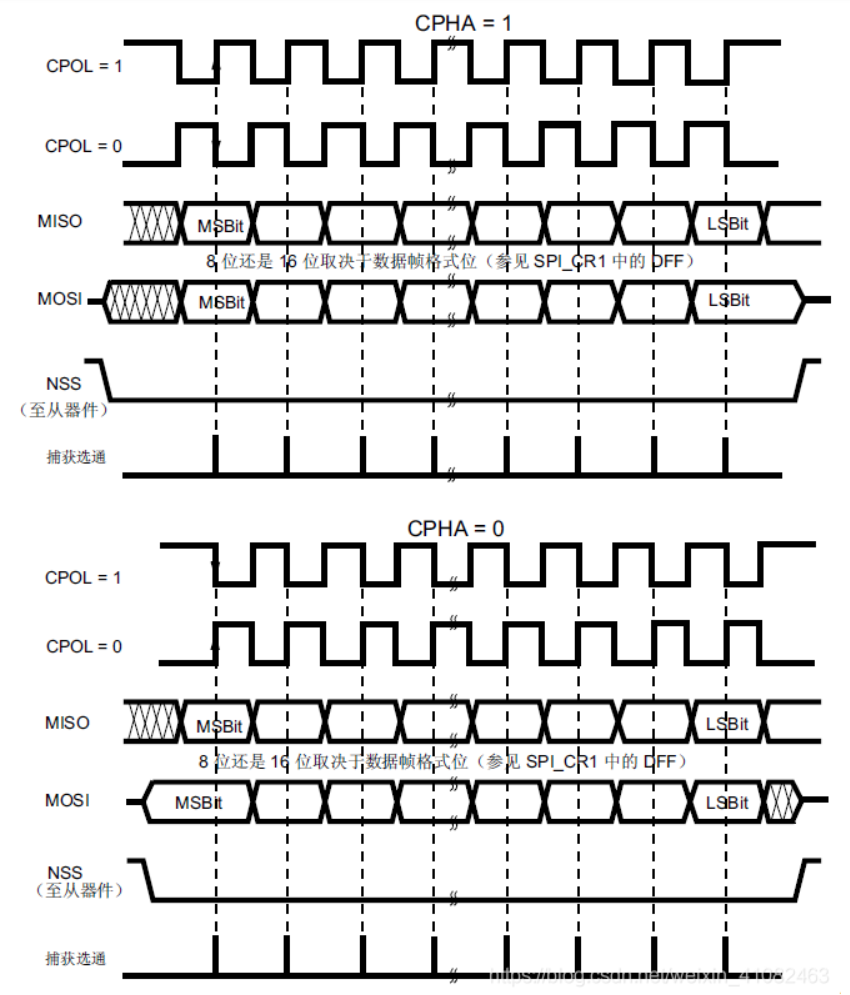

## STM32 SPI

## 物理层连接

共四条线：MOSI、MISO、SCK、NSS

| 信号线 | 作用                                                         |
| ------ | ------------------------------------------------------------ |
| MOSI   | 主机输出，从机输入（M>Master \| O>Output \| S>Slave \| I>Input) |
| MISO   | 主机输入，从机输出                                           |
| SCK    | 时钟信号，由主机产生，用于通信同步                           |
| NSS    | 从机使能信号，由主机控制（片选线）                           |

## SPI 的四种模式

*四种模式的区别*：总线空闲时 SCK 的时钟状态 （CPOL）及数据采样时刻 （CPHA）。

### CPOL

**SPI** 通讯设备处于空闲时（NSS为高电平时）SCK的状态。CPOL=0，则SCK线在空闲时为低电平；CPOL=1，则SCK线在空闲时为高电平。

### CPHA

数据采样时刻。CPHA=0，MOSI或MISO线上的信号将在SCK线的奇数个跳变沿被采样；CPHA=1，MOSI或MISO线上的信号在SCK线的偶数个跳变沿被采样。

**注**：四种模式都可以使用，但是主从设备必须采用同一种模式。

## STM32 模式选项（Mode）

* Full-Duplex Master （全双工主模式）
* Full-Duplex Slave（全双工从模式）
* Half-Duplex Master（单双工主模式）
* Half-Duplex Slave（单双工从模式）
* Receive Only Master（只接收主模式）
* Receive Only Slave（只接收从模式）
* Transmit Only Master（只发送主模式）
* Transmit Only Slave（只发送从模式）

## 硬件nss信号（Hardware NSS Signal）

- Disable
- Hardware NSS input Signal
- Hardware NSS Output Signal

## 参数设置

### 基本参数 （Basic Parameters）

* Frame Format（帧格式）
  * Motorola（摩托罗拉）
  * TI（德州仪器）
* Data Size（数据长度）
  * 8 Bits
  * 16 Bits
* First Bit（对齐形式）
  * MSB First（高位在前）
  * LSB First（低位在前）

### 时钟参数（Clock Parameters）

* Prescaler (for Baud Rate) （预分频器）
  * 2\4\8\16\32\64\128\256
* clock polarity (CPOL)（时钟极性）
  * Low
  * High
* Clock Phase (CPHA)
  * 1Edge
  * 2Edge

### 高级参数（Advanced Parameters）

* CRC Calculation
  * Disabled / Enable
* NSS Signal Type
  * 软件或硬件

