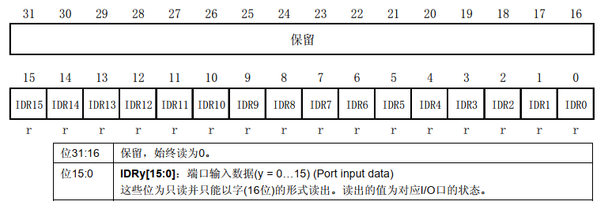
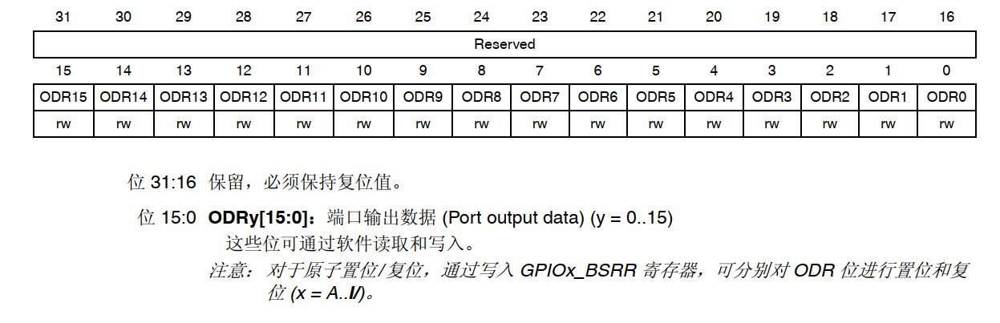
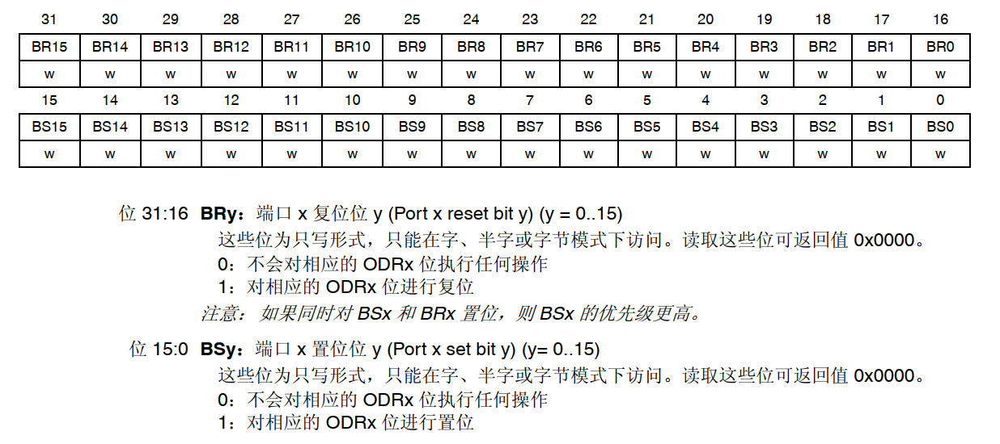
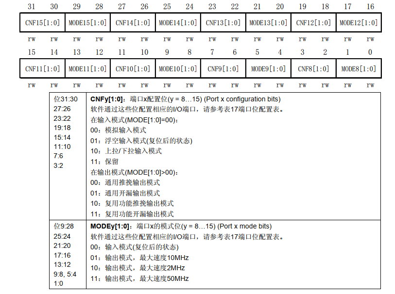

# STM32 GPIO 章节

## GPIO 的几种模式

* 输入浮空
* 输入上拉
* 输入下拉
* 模拟输入
* 开漏输出
* 推挽式输出
* 推挽式复用功能 - 开漏复用功能


### 输出模式

输出模式分为：==推挽输出==和==开漏输出==两种。==推挽输出==模式下引脚可以自行输出==高低==两种电平，但是电流驱动力较弱，适合于和数字元件通讯或驱动 LED；==开漏输出==只有==低电平==和==截止==两种状态，所以需要在电路上加上 ==上拉电阻 ==(一端电源一端接引脚的电阻) 才能在截止状态下输出高电平，开漏输出的电流驱动能力更强， 适合于做电流型的驱动。

## GPIO 寄存器列表

寄存器笔记：

* **GPIOx_ODR** ==输出数据寄存器==
* **GPIOx_IDR** ==输入数据寄存器==
* **GPIOx_BSRR**  ==置位/复位寄存器==
* **GPIOx_BRR**  ==复位寄存器==
* **GPIOx_CRL**  ==端口配置低寄存器==
* **GPIOx_CRH**  ==端口配置高寄存器==
* **GPIOx_LCKR**  ==端口配置锁定寄存器==
* **GPIOx_OTYPER**  ==端口输出类型寄存器==
* **GPIOx_MODER**  ==端口模式寄存器==
* **GPIOx_OSPEEDR**  ==端口输出速度寄存器==
* **GPIOx_PUPDR**  ==端口上拉/下拉寄存器==
* **GPIOx_AFRL**  ==复用功能低位寄存器==
* **GPIOx_AFRH**  ==复用功能高位寄存器==


## GPIOx_IDR 输入数据寄存器

地址偏移：0x08

复位值：0x0000XXXX




## GPIOx_ODR 输出数据寄存器

偏移地址：0x14

复位值：0x0000 0000




## GPIOx_BSRR 端口置位/复位寄存器

偏移地址：0x18

复位值：0x0000 0000



## GPIOx_CRH 端口配置高寄存器

偏移地址：0x04

复位值：0x4444 4444


GPIOx_CRL/GPIOx_CRH （x：A~F）寄存器用来对GPIO进行端口设置，如：设置GPIO为输入模式或输出模式。每个寄存器含有32位，每4位用来设置1个GPIO引脚功能。GPIOx_CRL/GPIOx_CRH 两个寄存器共含有64位，因此可完成对GPIO0~15的设定。其中GPIOx_CRL用于设置GPIO0~7引脚，GPIOx_CRH用于设置GPIO8~15引脚。





## GPIOx_CRL 端口配置低寄存器


## 寄存器方式控制 LED

```c
#define LED_ON      GPIOA->ODR    	|= (1U << 5)  // PA5 输出高
#define LED_OFF     GPIOA->ODR    	&= ~(1U<<5)   // PA5 输出低
#define LED_TOGGLE  GPIOA->ODR    	^= (1U << 5)  // PA5 取反（位异或）
#define KEY_STATE	(GPIOC->IDR >> 4) & 1	// 获取 PC4 引脚电平的高低
```

## 寄存器方式切换（输入模式/输出模式）

控制 ==GPIO== 为输入模式或输出模式是由 ==CRH== 或 ==CRL== 控制的，也叫配置寄存器，==0~7==引脚由 CRL寄存器控制，==8~15==引脚由 CRH 寄存器控制。


