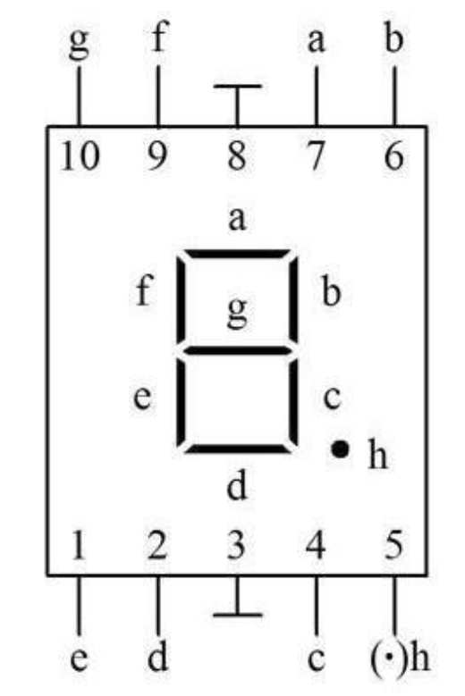

## 数码管

数码管（LED Segment Displays）是由多个发光二极管封装在一起组成“8”字型的器件，引线已在内部连接完成，只需引出它们的各个笔划，公共电极。共阳极就是把所有LED的阳极连接到共同接点com，每个LED的阴极分别为a、b、c、d、e、f、g及dp（小数点）；共阴极则是把所有LED的阴极连接到共同接点com，而每个LED的阳极分别为a、b、c、d、e、f、g及dp（小数点），如下图所示。

## 数码管共阴共阳区别

按发光二极管单元连接方式可分为共阳极数码管和共阴极数码管。

共阳数码管是指将所有发光二极管的阳极接到一起形成公共阳极(COM)的数码管，共阳数码管在应用时应将公共极COM接到+5V，当某一字段发光二极管的阴极为低电平时，相应字段就点亮，当某一字段的阴极为高电平时，相应字段就不亮。

共阴数码管是指将所有发光二极管的阴极接到一起形成公共阴极(COM)的数码管，共阴数码管在应用时应将公共极COM接到地线GND上，当某一字段发光二极管的阳极为高电平时，相应字段就点亮，当某一字段的阳极为低电平时，相应字段就不亮。

## 例子

**共阳数码管显示 '0'**

共阳数码管如果要显示某段，则要让该段为0

a b c d e f = 0 其他=1 ，编码为：0xC1 = 1100_0000

**共阳数码管显示 '0'**

共阳数码管如果要显示某段，则要让该段为1

a b c d e f = 1 其他=0 ，编码为：0x3F = 0011_1111

通过实验可知：数码管 a b c d e f g h 是从底到高排列的。a在最底,h在最高。

## 0~9 A~Z

