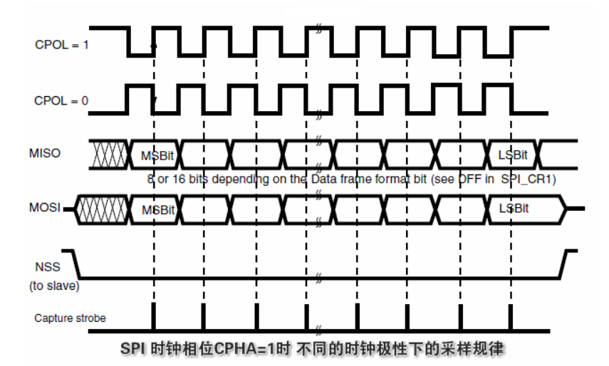
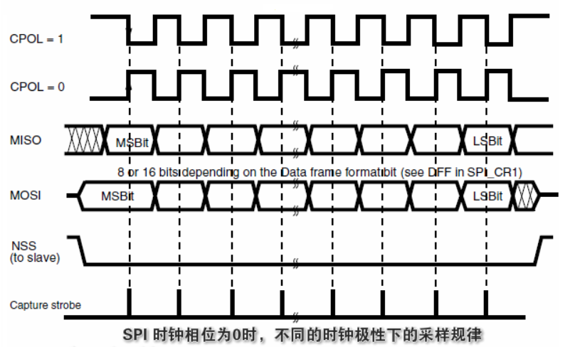

`SPI(Serial Peripheral Interface)`串行外设接口，是`Motorola`公司推出的一种`同步串行`接口技术。具有高速、全双工、同步的特点。总线本身并没有提供流控、应答确认和校验机制，需要特别注意。

## 数据收发

SPI 的数据收发是在时钟信号下采样的，一共有4种模式：

1. 在时钟的上升沿采集数据

2. 在时钟的下降沿采集数据

3. 高电平

4. 低电平

   

| 模式  | CPOL（时钟极性） | CPHA（时钟相位） |
| ----- | ---------------- | ---------------- |
| 模式1 | 0                | 0                |
| 模式2 | 0                | 1                |
| 模式3 | 1                | 0                |
| 模式4 | 1                | 1                |

   

## 时钟极性CPOL

用来决定在总线空闲时，同步时钟（`SCK`）信号线上的电位是高电平还是低电平。

当时钟极性为0时（`CPOL=0`），`SCK`信号线在空闲时为`低电平`；当时钟极性为1时（`CPOL=1`），SCK信号线在空闲时为`高电平`；

## 时钟相位CPHA

CPHA 用来决定何时进行信号采样。

## CPHA=1

当时钟相位为1时（CPHA=1），在SCK信号线的第二个跳变沿进行采样；这里的跳变沿究竟是上升沿还是下降沿？取决于时钟的极性。当时钟极性为0时，取下降沿；当时钟极性为1时，取上升沿；如下图：

## CPHA=0

当时钟相位为0时（CPHA=0），在SCK信号线的第一个跳变沿进行采样。跳变沿同样与时钟极性有关：当时钟极性为0时，取上升沿；当时钟极性为1时，取下降沿；如下图：

