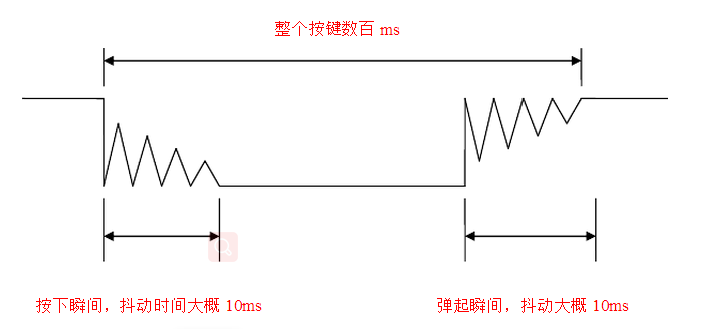

按键抖动图



## 延时消抖

代码一：

```c
#include <reg51.h>

sbit key=P1^0;
sbit led=P2^0;

void delay_ms(unsigned int t)
{
    unsigned int i,j;
    for(i=0; i<t; i++)
        for(j=0; j<120; j++);
}

void main(void)
{
    while(1)
    {
        if(key==0)
        {
            delay_ms(10);
            if(key==0)
            {
                led = !led;
                while(key==0);
            }
        }
    }
}
```

代码二：

```c
#include <reg51.h>

sbit key=P1^0;
sbit led=P2^0;

void delay_ms(unsigned int t)
{
    unsigned int i,j;
    for(i=0; i<t; i++)
        for(j=0; j<120; j++);
}

void main(void)
{
    int key_up=1;
    while(1)
    {
        if(key==0 && key_up==1)
        {
            delay_ms(10);
            key_up=0;
            if(key==0)
            {
                led = !led;
            }
        } else if(key==1) key_up=1;
    }
}
```

可以看到延时消抖最大弊端就是有延时，至少要消耗10ms~20ms的时间。

## 按键定时器消抖

按键消抖一般分为4步：

1. 判断按键是否按下
2. 消抖
3. 再次判断按键是否按下
4. 等待按键松开

定时器消抖原理

1. 判断按键是否按下
2. 若检测到有按键按下，则开启定时器中断，定时时间为10ms左右，使得按键按下10ms后进入定时中断，进入中断的时候键抖动时间已过。
3. 在定时器中断再次判断按键是否按下
4. 关闭定时器

代码一：

```c
#include <reg51.h>

sbit key=P1^0;
sbit led=P2^0;

void main(void)
{
    TMOD |= 0x01;
    TH0 = (65536-10000)/256;
    TL0 = (65536-10000)%256;
    ET0 = 1;
    EA = 1;
    TR0 = 0;
    while(1)
    {
        if(key==0)
        {
            TR0 = 1; // 打开定时器
        }
    }
    
}

void Timer0() interrupt 1
{
    TH0 = (65536-10000)/256;
    TL0 = (65536-10000)%256;
    
    TR0 = 0; // 关闭定时器
    if(key==0)
    {
        led=!led;
        while(key==0);
    }
}
```

可以看到，上面的代码依然有`while(key==0);` //等待按键松开这句代码，会让程序等待

`程序升级！最终代码`
更改电路，加入外部中断：

代码：

```c
#include <reg51.h>

sbit key=P3^2;
sbit led=P2^0;

void main(void)
{
    TMOD |= 0x01;
    TH0 = (65536-10000)/256;
    TL0 = (65536-10000)%256;
    ET0 = 1;
    TR0 = 0;
    
    IT0=1;
    EX0=1;
    EA=1;
    while(1)
    {
    }
}

void Timer0() interrupt 1
{
    TH0 = (65536-10000)/256;
    TL0 = (65536-10000)%256;
    
    TR0 = 0; // 关闭定时器
    if(key==0)
    {
        led=!led;
    }
}

void Int0() interrupt 0
{
    TR0=1;
}
```

流程：

按键外部中断 -> 开启定时器 -> 在定时函数中关闭定时器与读取按键电平 。


