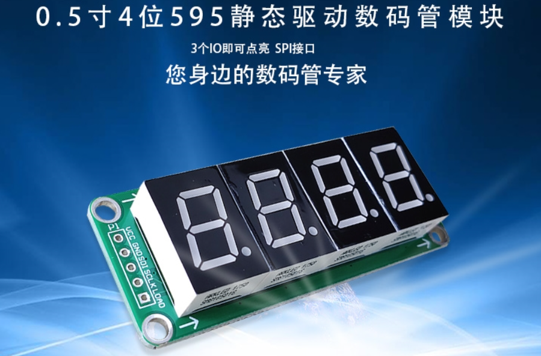
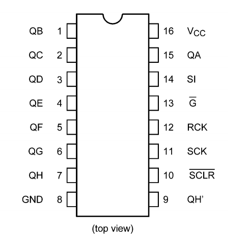

## 模块介绍

这里使用的时用 74HC595驱动的以静态方式显示的模块，淘宝图片如下：




## 模块驱动 IO

### SDI 数据输入

### SCLK 时钟脉冲

### LOAD 数据加载

## 74HC595 引脚定义

==74HC595==是一个==8位串行输入==、==并行输出==的位移缓存器：并行输出为==三态==输出。在==SCK== 的==上升沿==，串行数据由SDL输入到内部的8位位移缓存器，并由Q7'输出，而并行输出则是在LCK的上升沿将在8位位移缓存器的数据存入到8位并行输出缓存器。当串行数据输入端OE的控制信号为低使能时，并行输出端的输出值等于并行输出缓存器所存储的值。

74HC595是具有三态输出功能（即具有高电平、低电平和高阻抗三种输出状态）的门电路。输出寄存器可以直接清除。具有100MHz的移位频率。



| 序号 | 名称    | 描述                   |
| ---- | ------- | ---------------------- |
| 1    | QB      | 8位并行数据输出        |
| 2    | QC      | 8位并行数据输出        |
| 3    | QD      | 8位并行数据输出        |
| 4    | QE      | 8位并行数据输出        |
| 5    | QF      | 8位并行数据输出        |
| 6    | QG      | 8位并行数据输出        |
| 7    | QH      | 8位并行数据输出        |
| 8    | GND     | 地                     |
| 9    | QH`     | 一个串行输出           |
| 10   | SCLR/MR | 主复位（低电平有效）   |
| 11   | SCK     | 数据输入时钟线         |
| 12   | RCK     | 输出存储器锁存时钟线   |
| 13   | G/OE    | 输出有效（低电平有效） |
| 14   | SI/Ds   | 串行移位输入           |
| 15   | QA      | 8位并行数据输出        |
| 16   | VCC     | 电源                   |

### 使用方法

Q7': 级联输出端。将它接下一个595的DS端。

DS: 串行数据输入端,级联的话接上一级的Q7'。

74595的控制端说明：

==/MR(10脚)== 

低电平时将移位寄存器的数据清零。通常接到VCC防止数据清零。

==SH_CP/SCK(11脚)==

上升沿时数据寄存器的数据移位。Q0->Q1->Q2-->Q3-->...-->Q7;下降沿移位寄存器数据不变。(脉冲宽度：5V时，大于几十纳秒就行了。我通常都选微秒级)

==ST_CP/RCK(12脚)：==

上升沿时移位寄存器的数据进入数据存储寄存器，下降沿时存储寄存器数据不变。通常我将ST_CP置为低电平，当移位结束后，在ST_CP端产生一个正脉冲(5V时，大于几十纳秒就行了。我通常都选微秒级)，更新显示数据。

==/OE/G(13脚):==

 高电平时禁止输出(高阻态)。如果单片机的引脚不紧张，用一个引脚控制它，可以方便地产生闪烁和熄灭效果。比通过数据端移位控制要省时省力。


## 代码

==led74hc595.h==

```c
/*
 * @Author: 信念D力量
 * @Github: https://www.github.com/fy2008
 * @Gitee: https://gitee.com/zsf90
 * @website: https://fy2008.github.io
 * @FilePath: \74HC595D\Core\Inc\led74hc595.h
 * @Date: 2021-02-10 18:04:45
 * @LastEditTime: 2021-02-10 19:19:35
 * @LastEditors: Please set LastEditors
 * @Copyright(C): 信念D力量 (freerealmshn@163.com)
 * All Rights Reserved.
 * ----------------------------------------------
 * @Description: 
 * ----------------------------------------------
 * 
 */
#ifndef _LED_74HC595D_H
#define _LED_74HC595D_H

#include "main.h"

/* 数码管位枚举*/
typedef enum {
    GE_BIT,
    SHI_BIT,
    BAI_BIT,
    QIAN_BIT,
    WAN_BIT,
    SHIWAN_BIT,
    BAIWAN_BIT,
    QIANWAN_BIT
}LedBIT;

extern uint8_t data[];
extern SPI_HandleTypeDef hspi1;
void hc74595_display(uint32_t);
#endif
```

==led74hc595.c==

```c
/*
 * @Author: 信念D力量
 * @Github: https://www.github.com/fy2008
 * @Gitee: https://gitee.com/zsf90
 * @website: https://fy2008.github.io
 * @FilePath: \74HC595D\Core\Src\led74hc595.c
 * @Date: 2021-02-10 18:05:00
 * @LastEditTime: 2021-02-10 19:19:55
 * @LastEditors: Please set LastEditors
 * @Copyright(C): 信念D力量 (freerealmshn@163.com)
 * All Rights Reserved.
 * ----------------------------------------------
 * @Description: 
 * ----------------------------------------------
 * 
 */
#include "led74hc595.h"

void hc74595_display(uint32_t num){
    uint32_t qianwan = num / 10000000;       // 解析后的千万位数字
    uint32_t baiwan = num / 1000000 % 10;   // 解析后的百万位数字
    uint32_t shiwan = num / 100000 % 10;    // 解析后的十万位数字
    uint32_t wan = num / 10000 % 10;        // 解析后的万位数字
    uint32_t qian = num / 1000 % 10;        // 解析后的千位数字
    uint32_t bai = num / 100 % 10;          // 解析后的百位数字
    uint32_t shi = num /10 %10;             // 解析后的十位数字
    uint32_t ge = num %10;                  // 解析后的个位数字

    for (uint8_t j=0;j<8;j++){
      
      switch (j){
        case GE_BIT:
          // 个位
          HAL_SPI_Transmit(&hspi1, &data[ge], 1, 1000);     // SPI 输出
          break;
        case SHI_BIT:
          // 十位
          HAL_SPI_Transmit(&hspi1, &data[shi], 1, 1000);
          break;
        case BAI_BIT:
          // 百位
          HAL_SPI_Transmit(&hspi1, &data[bai], 1, 1000);
          break;
        case QIAN_BIT:
          // 千位
          HAL_SPI_Transmit(&hspi1, &data[qian], 1, 1000);
          break;
        case WAN_BIT:
          // 万位
          HAL_SPI_Transmit(&hspi1, &data[wan], 1, 1000);
          break;
        case SHIWAN_BIT:
          // 十万位
          HAL_SPI_Transmit(&hspi1, &data[shiwan], 1, 1000);
          break;
        case BAIWAN_BIT:
          // 万位
          HAL_SPI_Transmit(&hspi1, &data[baiwan], 1, 1000);
          break;
        case QIANWAN_BIT:
          // 万位
          HAL_SPI_Transmit(&hspi1, &data[qianwan], 1, 1000);
          break;
        default:
          break;
      }
    } // end for

    /* 让锁存输出一个高电平脉冲,让595芯片的并行数据输出 */
    HAL_GPIO_WritePin(LED_LOAD_GPIO_Port, LED_LOAD_Pin, GPIO_PIN_SET);
    HAL_Delay(1);
    HAL_GPIO_WritePin(LED_LOAD_GPIO_Port, LED_LOAD_Pin, GPIO_PIN_RESET);
}

```

代码中的 `LED_LOAD_Pin` 引脚控制的时 ==595==芯片的 ==ST_CP/RCK(12脚)==。

