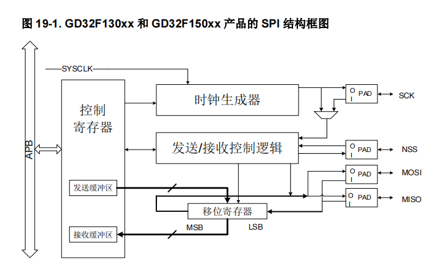

## 模块介绍

这里使用的时用 74HC595驱动的以静态方式显示的模块，淘宝图片如下：


## 模块驱动 IO

### SDI 数据输入

### SCLK 时钟脉冲

### LOAD 数据加载

## 74HC595 引脚定义

==74HC595==是一个==8位串行输入==、==并行输出==的位移缓存器：并行输出为==三态==输出。在==SCK== 的==上升沿==，串行数据由SDL输入到内部的8位位移缓存器，并由Q7'输出，而并行输出则是在LCK的上升沿将在8位位移缓存器的数据存入到8位并行输出缓存器。当串行数据输入端OE的控制信号为低使能时，并行输出端的输出值等于并行输出缓存器所存储的值。

74HC595是具有三态输出功能（即具有高电平、低电平和高阻抗三种输出状态）的门电路。输出寄存器可以直接清除。具有100MHz的移位频率。


| 序号 | 名称    | 描述                   |
| ---- | ------- | ---------------------- |
| 1    | QB      | 8位并行数据输出        |
| 2    | QC      | 8位并行数据输出        |
| 3    | QD      | 8位并行数据输出        |
| 4    | QE      | 8位并行数据输出        |
| 5    | QF      | 8位并行数据输出        |
| 6    | QG      | 8位并行数据输出        |
| 7    | QH      | 8位并行数据输出        |
| 8    | GND     | 地                     |
| 9    | QH`     | 一个串行输出           |
| 10   | SCLR/MR | 主复位（低电平有效）   |
| 11   | SCK     | 数据输入时钟线         |
| 12   | RCK     | 输出存储器锁存时钟线   |
| 13   | G/OE    | 输出有效（低电平有效） |
| 14   | SI/Ds   | 串行移位输入           |
| 15   | QA      | 8位并行数据输出        |
| 16   | VCC     | 电源                   |

### 使用方法

Q7': 级联输出端。将它接下一个595的DS端。

DS: 串行数据输入端,级联的话接上一级的Q7'。

74595的控制端说明：

==/MR(10脚)== 

低电平时将移位寄存器的数据清零。通常接到VCC防止数据清零。

==SH_CP/SCK(11脚)==

上升沿时数据寄存器的数据移位。Q0->Q1->Q2-->Q3-->...-->Q7;下降沿移位寄存器数据不变。(脉冲宽度：5V时，大于几十纳秒就行了。我通常都选微秒级)

==ST_CP/RCK(12脚)：==

上升沿时移位寄存器的数据进入数据存储寄存器，下降沿时存储寄存器数据不变。通常我将ST_CP置为低电平，当移位结束后，在ST_CP端产生一个正脉冲(5V时，大于几十纳秒就行了。我通常都选微秒级)，更新显示数据。

==/OE/G(13脚):==

 高电平时禁止输出(高阻态)。如果单片机的引脚不紧张，用一个引脚控制它，可以方便地产生闪烁和熄灭效果。比通过数据端移位控制要省时省力。


## 代码

==led74hc595.h==

```c
/*
 * @Author: 信念D力量
 * @Github: https://www.github.com/fy2008
 * @Gitee: https://gitee.com/zsf90
 * @website: https://fy2008.github.io
 * @FilePath: \74HC595D\Core\Inc\led74hc595.h
 * @Date: 2021-02-10 18:04:45
 * @LastEditTime: 2021-02-10 19:19:35
 * @LastEditors: Please set LastEditors
 * @Copyright(C): 信念D力量 (freerealmshn@163.com)
 * All Rights Reserved.
 * ----------------------------------------------
 * @Description: 
 * ----------------------------------------------
 * 
 */
#ifndef _LED_74HC595D_H
#define _LED_74HC595D_H

#include "main.h"

/* 数码管位枚举*/
typedef enum {
    GE_BIT,
    SHI_BIT,
    BAI_BIT,
    QIAN_BIT,
    WAN_BIT,
    SHIWAN_BIT,
    BAIWAN_BIT,
    QIANWAN_BIT
}LedBIT;

extern uint8_t data[];
extern SPI_HandleTypeDef hspi1;
void hc74595_display(uint32_t);
#endif
```

==led74hc595.c==

```c
/*
 * @Author: 信念D力量
 * @Github: https://www.github.com/fy2008
 * @Gitee: https://gitee.com/zsf90
 * @website: https://fy2008.github.io
 * @FilePath: \74HC595D\Core\Src\led74hc595.c
 * @Date: 2021-02-10 18:05:00
 * @LastEditTime: 2021-02-10 19:19:55
 * @LastEditors: Please set LastEditors
 * @Copyright(C): 信念D力量 (freerealmshn@163.com)
 * All Rights Reserved.
 * ----------------------------------------------
 * @Description: 
 * ----------------------------------------------
 * 
 */
#include "led74hc595.h"

void hc74595_display(uint32_t num){
    uint32_t qianwan = num / 10000000;       // 解析后的千万位数字
    uint32_t baiwan = num / 1000000 % 10;   // 解析后的百万位数字
    uint32_t shiwan = num / 100000 % 10;    // 解析后的十万位数字
    uint32_t wan = num / 10000 % 10;        // 解析后的万位数字
    uint32_t qian = num / 1000 % 10;        // 解析后的千位数字
    uint32_t bai = num / 100 % 10;          // 解析后的百位数字
    uint32_t shi = num /10 %10;             // 解析后的十位数字
    uint32_t ge = num %10;                  // 解析后的个位数字

    for (uint8_t j=0;j<8;j++){
      
      switch (j){
        case GE_BIT:
          // 个位
          HAL_SPI_Transmit(&hspi1, &data[ge], 1, 1000);     // SPI 输出
          break;
        case SHI_BIT:
          // 十位
          HAL_SPI_Transmit(&hspi1, &data[shi], 1, 1000);
          break;
        case BAI_BIT:
          // 百位
          HAL_SPI_Transmit(&hspi1, &data[bai], 1, 1000);
          break;
        case QIAN_BIT:
          // 千位
          HAL_SPI_Transmit(&hspi1, &data[qian], 1, 1000);
          break;
        case WAN_BIT:
          // 万位
          HAL_SPI_Transmit(&hspi1, &data[wan], 1, 1000);
          break;
        case SHIWAN_BIT:
          // 十万位
          HAL_SPI_Transmit(&hspi1, &data[shiwan], 1, 1000);
          break;
        case BAIWAN_BIT:
          // 万位
          HAL_SPI_Transmit(&hspi1, &data[baiwan], 1, 1000);
          break;
        case QIANWAN_BIT:
          // 万位
          HAL_SPI_Transmit(&hspi1, &data[qianwan], 1, 1000);
          break;
        default:
          break;
      }
    } // end for

    /* 让锁存输出一个高电平脉冲,让595芯片的并行数据输出 */
    HAL_GPIO_WritePin(LED_LOAD_GPIO_Port, LED_LOAD_Pin, GPIO_PIN_SET);
    HAL_Delay(1);
    HAL_GPIO_WritePin(LED_LOAD_GPIO_Port, LED_LOAD_Pin, GPIO_PIN_RESET);
}

```

代码中的 `LED_LOAD_Pin` 引脚控制的时 ==595==芯片的 ==ST_CP/RCK(12脚)==。


## GD32F150C8T6 驱动数码管

这里我们要用到 GD32单片机的 SPI 接口，所有首先要先对 SPI 接口进行配置。驱动数码管一共需要 3 个 IO 口，分别为：MOSI、SCL、LOAD，前两个用 SPI 接口，LOAD用普通的输出IO即可。

GD32F150C8T6 有 2 个 SPI 外设，SPI0/I2S0在 APB2总线上，SPI1在APB1总线上。

### IO 分配

这里我们使用 GD32F150C8T6 的 SPI0 + 1个普通 IO 输出。

| 单片机         | 数码管 |
| -------------- | ------ |
| SPI0_SCK(PA5)  | SCLK   |
| SPI0_MOSI(PA7) | SDI    |
| PA4            | LOAD   |

### SPI 配置

首先我们先配置 SPI 的工作模式：`主机模式`或`从机模式`。

数据帧长度可选 8位或16位

配置表

| 列表                |           |
| ------------------- | --------- |
| 数据帧长度          | 8位或16位 |
| 低位在前或高位在前  |           |
| 软件或硬件NSS管理   |           |
| CRC计数、发送、校验 |           |
| DMA模式             |           |



#### NSS 描述

| 列表     |      |
| ------------------- | ---- |
| 软件 NSS 模式： | 不使用                                                       |
| 主机硬件 NSS 模式： | 为 NSS 输出，NSSDRV=1 时，为单主机模式，NSSDRV=0 时，为多主机模式。 |
| 从机硬件 NSS 模式： | 为 NSS 输入，作为从机的片选信号。 |

#### CKPL和CKPH

`SPI_CTL0` 寄存器中有 `CKPL`和`CKPH`两位，`CKPH`位决定了`SPI`时钟和数据信号的时序。`CKPL`位决定了空闲状态时`SCK`的电平，`CKPH`位决定了第一个或第二个时钟跳变沿为有效采样边沿。

## GD32 SPI 时钟极性定义

```c
/* SPI clock phase and polarity */
#define SPI_CK_PL_LOW_PH_1EDGE          ((uint32_t)0x00000000U)                 /*!< SPI clock polarity is low level and phase is first edge */
#define SPI_CK_PL_HIGH_PH_1EDGE         SPI_CTL0_CKPL                           /*!< SPI clock polarity is high level and phase is first edge */
#define SPI_CK_PL_LOW_PH_2EDGE          SPI_CTL0_CKPH                           /*!< SPI clock polarity is low level and phase is second edge */
#define SPI_CK_PL_HIGH_PH_2EDGE         (SPI_CTL0_CKPL | SPI_CTL0_CKPH)         /*!< SPI clock polarity is high level and phase is second edge */
```


## 数码管编码

```c
/* 共阳 */
uint8_t led_code[] = {
    0xc0,   // 0 ->0
    0xf9,   // 1 ->1
    0xa4,   // 2 ->2
    0xb0,   // 3 ->3
    0x99,   // 4 ->4
    0x92,   // 5 ->5
    0x82,   // 6 ->6
    0xf8,   // 7 ->7
    0x80,   // 8 ->8
    0x90,   // 9 ->9
    0x7f,   // . ->10
    0x88,   // A ->11
    0x83,   // B ->12
    0xc6,   // C ->13
    0xa1,   // D ->14
    0x86,   // E ->15
    0x8e,   // F ->16
    0xc2,   // G ->17
    0x89,   // H ->18
    0xf0,   // I ->19
    0xf1,   // J ->20
    0xa8,   // K ->21
    0xc7,   // L ->22
    0xc8,   // M ->23
    0xab,   // N ->24
    0xa3,   // O ->25
    0x8c,   // P ->26
    0x98,   // Q ->27
    0xce,   // R ->28
    0xb6,   // S ->29
    0x87,   // T ->30
    0xc1,   // U ->31
    0x81,   // V ->32
    0x7e,   // W ->33
    0x9B,   // X ->34
    0x91,   // Y ->35
    0xa5,   // Z ->36
    0x00,   // 全亮 ->37
    0xff    // 全灭 ->38
};
```

## GD32 数码管驱动代码

```c
/*******************************************************************************
 * @file    74hc595_led.h
 * @date    2021.10.21
 * @author  信念D力量
 * @brief   使用 74HC595 用串行线控制多位 LED 数码管
 * @github  https://github.com/zsf90/GD32F150C8T6-EXAMPLE
 ******************************************************************************/
#ifndef __74HC595_LED_H
#define __74HC595_LED_H

#include "gd32f1x0.h"

extern uint8_t led_code[];


/* 数码管 SPI 初始化 */
void init_74hc595(void);
uint8_t spi_rw_byte(uint8_t data);
void hc595_show_number(uint16_t n);
void hc595_all_test(void);
#endif /* __74HC595_LED_H */
```

```c
#include "74hc595_led.h"

#include "gd32f1x0.h"
#include "systick.h"

#define LOAD_PORT   GPIOA
#define LOAD_PIN    GPIO_PIN_12
#define LOAD_LOW    gpio_bit_reset(LOAD_PORT, LOAD_PIN)
#define LOAD_HIGH   gpio_bit_set(LOAD_PORT, LOAD_PIN)

/* 共阳 */
uint8_t led_code[] = {
    0xc0,   // 0 ->0
    0xf9,   // 1 ->1
    0xa4,   // 2 ->2
    0xb0,   // 3 ->3
    0x99,   // 4 ->4
    0x92,   // 5 ->5
    0x82,   // 6 ->6
    0xf8,   // 7 ->7
    0x80,   // 8 ->8
    0x90,   // 9 ->9
    0x7f,   // . ->10
    0x88,   // A ->11
    0x83,   // B ->12
    0xc6,   // C ->13
    0xa1,   // D ->14
    0x86,   // E ->15
    0x8e,   // F ->16
    0xc2,   // G ->17
    0x89,   // H ->18
    0xf0,   // I ->19
    0xf1,   // J ->20
    0xa8,   // K ->21
    0xc7,   // L ->22
    0xc8,   // M ->23
    0xab,   // N ->24
    0xa3,   // O ->25
    0x8c,   // P ->26
    0x98,   // Q ->27
    0xce,   // R ->28
    0xb6,   // S ->29
    0x87,   // T ->30
    0xc1,   // U ->31
    0x81,   // V ->32
    0x7e,   // W ->33
    0x9B,   // X ->34
    0x91,   // Y ->35
    0xa5,   // Z ->36
    0x00,   // 全亮 ->37
    0xff    // 全灭 ->38
};
char *error_code = "ERR1";


/* 文件内函数声明 */
void spi_config(void);
void gpio_config(void);
void rcu_config(void);


/* 数码管 SPI 初始化 */

/*******************************************************************************
 * @brief 数码管 SPI 配置
 ******************************************************************************/
void init_74hc595(void)
{
    rcu_config();       /* RCU Config */
    gpio_config();      /* GPIO Config */
    spi_config();       /* SPI Config */
    spi_enable(SPI0);   /* 使能 SPI0 */
}

/*******************************************************************************
 * @brief SPI 配置
 ******************************************************************************/
void spi_config(void)
{
    spi_parameter_struct spi_init_struct;
    /* deinitialize SPI and the parameters */
    spi_i2s_deinit(SPI0);
    spi_struct_para_init(&spi_init_struct);
    
    /* SPI0 parameter config */
    spi_init_struct.trans_mode              = SPI_TRANSMODE_FULLDUPLEX; /* SPI 通信模式配置 */
    spi_init_struct.device_mode             = SPI_MASTER; /* 主机从机模式配置 */
    spi_init_struct.frame_size              = SPI_FRAMESIZE_8BIT; /* 数据帧大小 */
    spi_init_struct.clock_polarity_phase    = SPI_CK_PL_LOW_PH_1EDGE; /* PL 空闲时低电平，PH 第一个边沿采样 */
    spi_init_struct.nss                     = SPI_NSS_SOFT; /* SPI NSS control by handware or software */
    spi_init_struct.prescale                = SPI_PSC_16; /* SPI预分频因子 */
    spi_init_struct.endian                  = SPI_ENDIAN_MSB; /* 高位先发 */
    spi_init(SPI0, &spi_init_struct);
}

/*******************************************************************************
 * @brief SPI GPIO 配置
 ******************************************************************************/
void gpio_config(void)
{
    gpio_mode_set(GPIOA, GPIO_MODE_OUTPUT, GPIO_PUPD_NONE, GPIO_PIN_12);
    gpio_output_options_set(GPIOA, GPIO_OTYPE_PP, GPIO_OSPEED_50MHZ,GPIO_PIN_12);
    LOAD_LOW;
    
    /* SPI0 GPIO config: SCK/PA5, MOSI/PA7 */
    gpio_af_set(GPIOA, GPIO_AF_0, GPIO_PIN_5 | GPIO_PIN_6 | GPIO_PIN_7);
    gpio_mode_set(GPIOA, GPIO_MODE_AF, GPIO_PUPD_NONE, GPIO_PIN_5 | GPIO_PIN_6 | GPIO_PIN_7);
    gpio_output_options_set(GPIOA, GPIO_OTYPE_PP, GPIO_OSPEED_50MHZ, GPIO_PIN_5 | GPIO_PIN_6 | GPIO_PIN_7);
    
    
}

void rcu_config(void)
{
    rcu_periph_clock_enable(RCU_GPIOA);
    rcu_periph_clock_enable(RCU_SPI0);
}

void hc595_show_number(uint16_t n)
{
    uint8_t ge = n % 10;
    uint8_t shi = n / 10 % 10;
    uint8_t bai = n / 100 % 10;
    uint8_t qian = n / 1000;
    uint8_t i;
    for(i=0; i<4; i++){
        switch(i)
        {
        case 0:
            spi_rw_byte(led_code[ge]);
            break;
        case 1:
            spi_rw_byte(led_code[shi]);
            break;
        case 2:
            spi_rw_byte(led_code[bai]);
            break;
        case 3:
            spi_rw_byte(led_code[qian]);
            break;
        }
    }
    LOAD_HIGH;
    delay_1ms(1);
    LOAD_LOW;
}

uint8_t spi_rw_byte(uint8_t data)
{
    uint16_t tmp;
    while(spi_i2s_flag_get(SPI0, SPI_FLAG_TBE) == RESET);
    spi_i2s_data_transmit(SPI0, data);
    while(spi_i2s_flag_get(SPI0, SPI_FLAG_RBNE) == RESET);
    tmp = spi_i2s_data_receive(SPI0);
    return ((uint8_t)(tmp & 0xff));
}

void hc595_all_test(void)
{
    for(uint8_t x=0; x<38; x++){
        for(uint8_t i=0; i<4; i++)
        {
            switch(i)
            {
                case 0:
                    spi_rw_byte(led_code[x]);
                    break;
                case 1:
                    spi_rw_byte(led_code[38]);
                    break;
                case 2:
                    spi_rw_byte(led_code[38]);
                    break;
                case 3:
                    spi_rw_byte(led_code[38]);
                    break;
            }
        }
        LOAD_HIGH;
        delay_1ms(1);
        LOAD_LOW;
        delay_1ms(500);
    }  
}
```

