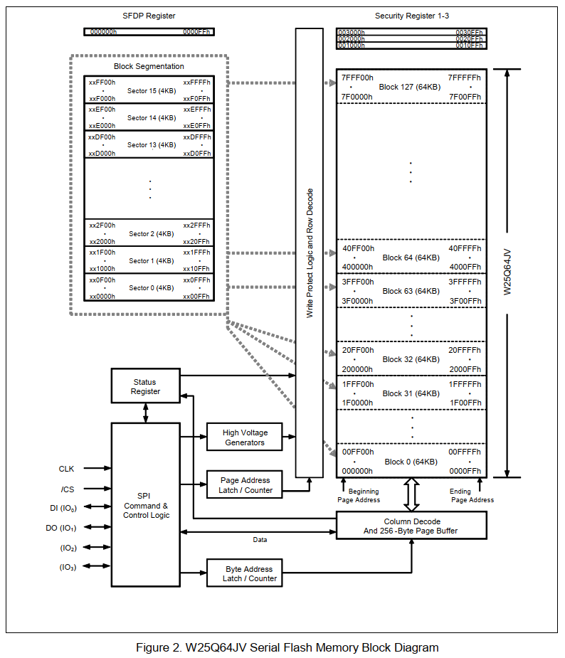
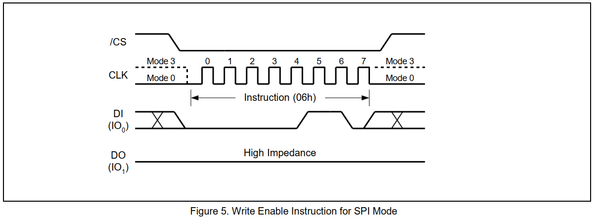
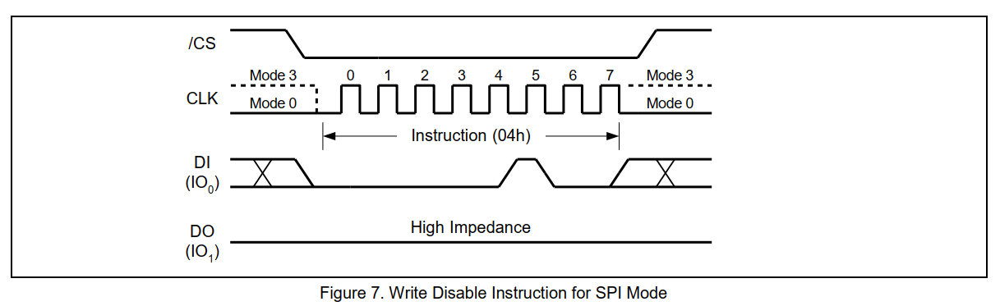
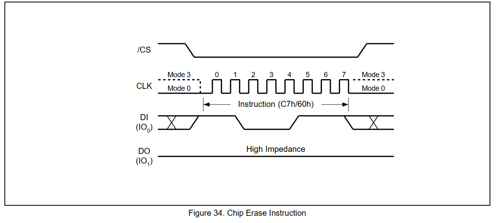
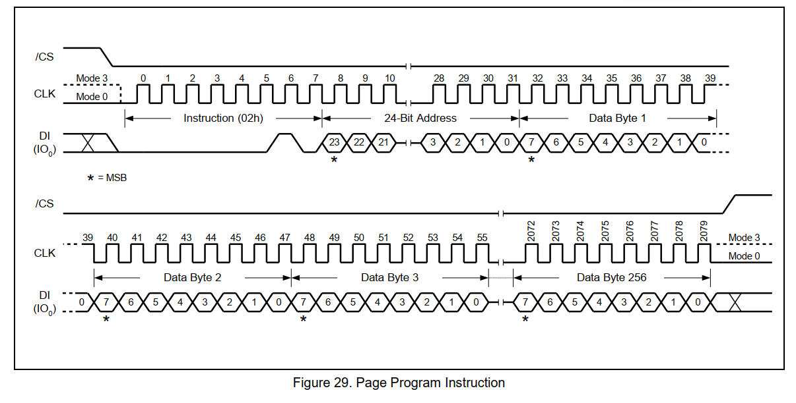
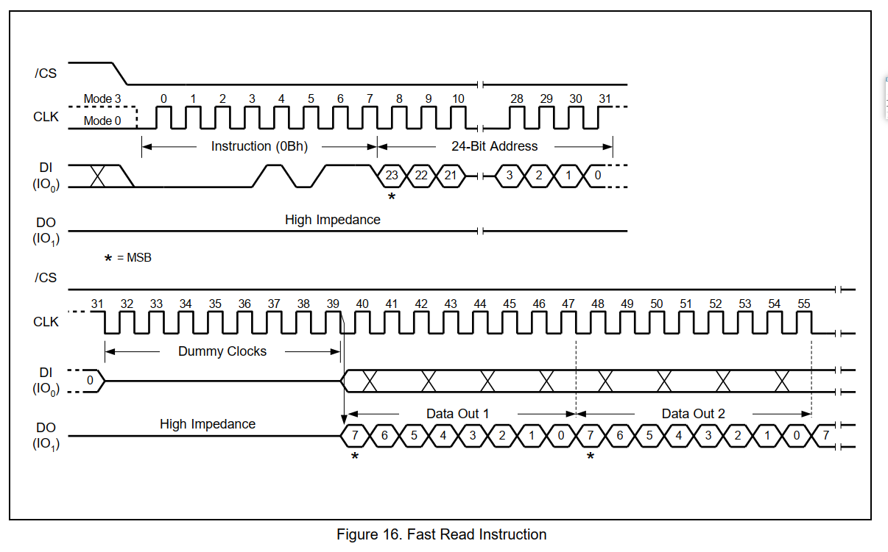
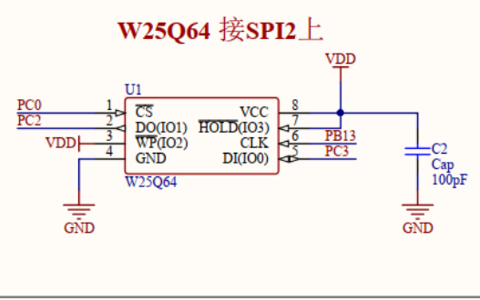

# W25QXX Flash存储芯片

W25Q64是华邦公司推出的大容量SPI FLASH产品，其容量为64Mb。该25Q系列的器件在灵活性和性能方面远远超过普通的串行闪存器件。W25Q64将8M字节的容量分为128个块，每个块大小为64K字节，每个块又分为16个扇区，每个扇区4K个字节。**W25Q64的最小==擦除==单位为一个扇区，也就是每次必须擦除==4K个字节==**。所以，这需要给W25Q64开辟一个至少4K的缓存区，这样必须要求芯片有4K以上的SRAM才能有很好的操作。

W25Q64的擦写周期多达10W次，可将数据保存达20年之久，支持2.7~3.6V的电压，支持标准的SPI，还支持双输出/四输出的SPI，最大SPI时钟可达80Mhz。

## W25Q64 特性

- [x] 支持标准、双输出和四输出的SPI
- [x] 高性能串行闪存
- [x] 高达普通串行闪存性能的6倍
- [x] 80Mhz的时钟操作
- [x] 支持160Mhz的双输出SPI
- [x] 支持320Mhz的四输出SPI
- [x] 40MB/S的数据连续传输速率
- [x] 高效的“连续读取模式”
- [x] 低指令开销
- [x] 仅需8个时钟周期处理内存
- [x] 允许XIP操作
- [x] 性能优于X16并行闪存
- [x] 低功耗，温度范围宽
- [x] 单电源2.7V至3.6V
- [x] 4mA有源电流
- [x] -40°C 至+85°C的正常运行温度范围
- [x] 灵活的4KB扇区构架
- [x] 扇区统一擦除（4KB）
- [x] 块擦除（32KB和64KB）
- [x] 1到256个字节编程
- [x] 超过10万次擦除/写循环
- [x] 超过20年的数据保存
- [x] 高级的安全功能
- [x] 软件和硬件写保护
- [x] 自上至下，扇区或块选择
- [x] 锁定和保护OTP
- [x] 每个设备都有唯一的64位ID
- [x] 有效的空间的包装
- [x] 8-pin SOIC 208-mil
- [x] 8-pin PDIP 300-mil
- [x] 8-pad WSON 8x6-mm
- [x] 16-pin SOIC 300-mil

## 芯片引脚

- [x] /CS : 片选信号输入
- [x] DO(IO1) : 数据输出（数据输入输出1)
- [x] /WP(IO2) : 写保护输入（数据输入输出2）
- [x] GND : 地
- [x] DI(IO0) : 数据输入（数据输入输出0）
- [x] CLK ：串行时钟输入
- [x] /HOLD(IO3) : HOLD输入（数据输入输出3），暂停
- [x] VCC : 电源 

## 容量大小

| 型号    | 总容量(比特位)      | 块数量 | 扇区数量 | 页数量  | JEDEC ID |
| ------- | ------------------- | ------ | -------- | ------- | -------- |
| W25Q512 | 512M比特（64M字节） | 1024   | 16,384   | 262,144 | 0x401A   |
| W25Q256 | 256M比特（32M字节） | 512    | 8192     | 131,072 | 0x4019   |
| W25Q128 | 128M比特（16M字节） | 256    | 4096     | 65,536  | 0x4018   |
| W25Q64  | 64M比特（8M字节）   | 128    | 2048     | 32,768  | 0x4017   |
| W25Q32  | 32M比特（4M字节）   | 64     | 1024     | 16,384  | 0x4016   |
| W25Q16  | 16M比特（2M字节）   | 8      | 512      | 8,192   | 0x4015   |

| 块Bytes | 扇区Bytes | 页Bytes |
| ------- | --------- | ------- |
| 64K     | 4K        | 256     |

## 框图



## 写使能（==06H==）

写使能命令是 **0x06**，写使能指令将状态寄存器1中的写启用锁存器(WEL)位设置为1。
WEL位必须设置在每个页程序，四页程序，扇区擦除，块擦除，芯片之前
擦除，写入状态寄存器和擦除/程序安全寄存器指令。写使能指令
是否通过驱动/CS低输入，将指令码“06h”移到上升边缘的数据输入(DI)引脚
的CLK，然后驱动/CS高。

### 时序图



### 代码

```c
/*******************************************************************************
 * @description: W25QXX 写使能
 * @param {*}
 * @return {*}
 ******************************************************************************/
void w25qxx_WriteEnable(void)
{
	HAL_GPIO_WritePin(_W25QXX_CS_GPIO, _W25QXX_CS_PIN, GPIO_PIN_RESET); // 片选拉低
	w25qxx_spi(W25QXX_WRITE_ENABLE);	// 发送写使能命令
	HAL_GPIO_WritePin(_W25QXX_CS_GPIO, _W25QXX_CS_PIN, GPIO_PIN_SET); // 片选拉高
	W25qxx_Delay(1); // 1ms 延迟
}
```


## 写禁能（==04H==）

写禁能指令是**0x04**，写禁用指令(图7)将状态寄存器1中的写使能锁存器(WEL)位重置为0。
通过芯片 /CS 拉低输入写禁用指令，将指令码“04h”移到DI引脚
然后/CS拉高。注意，WEL钻头在上电后和完成后会自动复位
写状态寄存器，擦除/程序安全寄存器，页程序，四页程序，扇区
擦除，块擦除，芯片擦除和重置指令。

### 时序图



### 程序

```c
/*******************************************************************************
 * @description: W25QXX 写禁能
 * @param {*}
 * @return {*}
 ******************************************************************************/
void w25qxx_WriteDisable(void)
{
	HAL_GPIO_WritePin(_W25QXX_CS_GPIO, _W25QXX_CS_PIN, GPIO_PIN_RESET);		// 片选拉低
	w25qxx_spi(W25QXX_WRITE_DISABLE);	// 发送写禁能命令
	HAL_GPIO_WritePin(_W25QXX_CS_GPIO, _W25QXX_CS_PIN, GPIO_PIN_SET);	// 片选拉高
	W25qxx_Delay(1);
}
```


## 擦除芯片（==C7H==/==60H==）

芯片擦除命令是 **0xC7**或**0x69**，

### 时序图



## 擦除块（==D8H==/==52H==）

## 擦除扇区（==20H==）

## 页编程（==02H==）

页编程指令能在一页只内写入1~256个字节的数据，该命令不支持自动换页。

在进行页编程之前需要先把状态寄存器1的WEL位置1，方法是拉低 /CS 引脚。然后发送指令码 0x02，后面再发送一个24位的地址（A23~A0）和至少一个数据字节，写入的数据由DI引脚进入W25Q芯片内。

注意：

如果要写一整页256个字节时，则该页的最后一个地址字节（8个最低有效地址位）应该设置为0.如果最后一个地址字节不为零，并且要写入的数据大于页剩余地址长度时，寻址将自动换行到页的开头。

数据写完最后一位之后 /CS 引脚必须拉高。如果不拉高页编程指令将不被执行。



## 读状态寄存器1（==05H==）

## 读状态寄存器2（==35H==）

## 读状态寄存器3（==15H==）

## 写状态寄存器1（==01H==）

## 写状态寄存器2（==31H==）

## 写状态寄存器3（==11H==）

## 读唯一ID（==4BH==）


## 读 JEDEC ID（==9FH==）

每个型号的 JEDEC ID 都不同，通过发送 **0x9F**指令可以获取 JEDEC ID，通过  JEDEC ID 可以判断当前使用的是那个型号的W25qxx芯片。

```c
/*******************************************************************************
 * @description: 读取 JEDEC ID （三个字节 24位）
 * @param {*}
 * @return {*}
 ******************************************************************************/
uint32_t w25qxx_ReadID(void){
	uint32_t Temp = 0, Temp0 = 0, Temp1 = 0, Temp2 = 0;
	HAL_GPIO_WritePin(_W25QXX_CS_GPIO, _W25QXX_CS_PIN, GPIO_PIN_RESET);
	w25qxx_spi(W25QXX_READ_JEDEC_ID);
	Temp0 = w25qxx_spi(W25QXX_DUMMY_BYTE);
	Temp1 = w25qxx_spi(W25QXX_DUMMY_BYTE);
	Temp2 = w25qxx_spi(W25QXX_DUMMY_BYTE);
	HAL_GPIO_WritePin(_W25QXX_CS_GPIO, _W25QXX_CS_PIN, GPIO_PIN_SET);
	Temp = (Temp0 << 16) | (Temp1 << 8) | Temp2;
	return Temp;
}
```

```c
printf("JEDEC ID:\%lX\r\n", w25qxx_ReadID()); // 通过串口打印出 JEDEC ID
```


## Fast Read (0Bh)  

快速读指令与读数据指令相似，不同的是它可以在最高的位置操作FR的可能频率(见交流电气特性)。这是通过添加8个“dummy”来完成的。24位地址后的时钟如图16所示。假时钟允许设备内部电路额外的时间设置初始地址。在假时钟期间，DO引脚上的数据值是a“不在乎”。



## W25Q64 打印的信息

```
===函数Printf函数发送数据===
w25qxx Init Begin ...
w25qxx ID:0xEF4017
w25qxx Chip: w25q64
w25qxx Page Size: 256 Bytes
w25qxx Page Count: 32768
w25qxx Sector Size: 4096 Bytes
w25qxx Sector Count: 2048
w25qxx Block Size: 65536 Bytes
w25qxx Block Count: 128
w25qxx Capacity: 8192 KiloBytes
w25qxx Uniq ID:223963232199477652
w25qxx Init Done
++++扇区擦除测试++++
w25qxx EraseSector 0 Begin...
w25qxx EraseSector done after 13 ms
++++块擦除测试++++
w25qxx EraseBlock 0 Begin...
w25qxx EraseBlock done after 10 ms
++++芯片擦除测试++++
w25qxx EraseChip Begin...
w25qxx EraseBlock done after 9 ms!
```


## W25QXX 电路图

