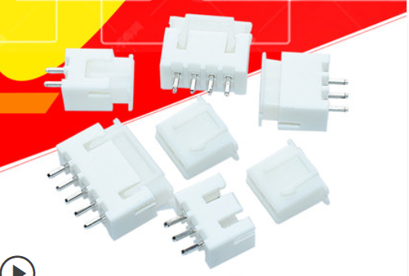
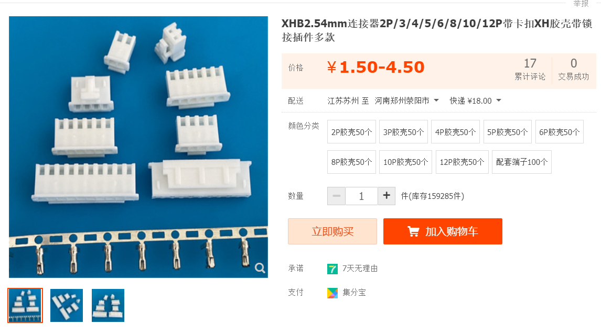
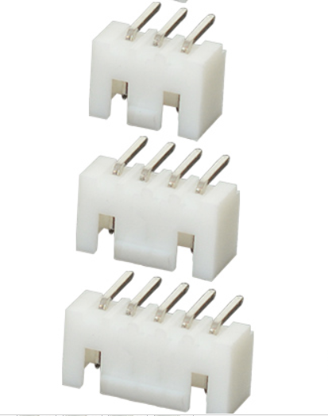
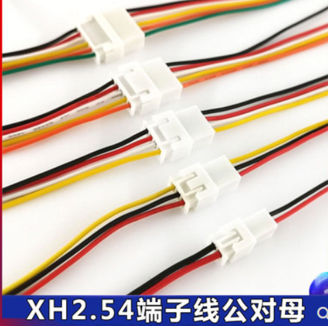
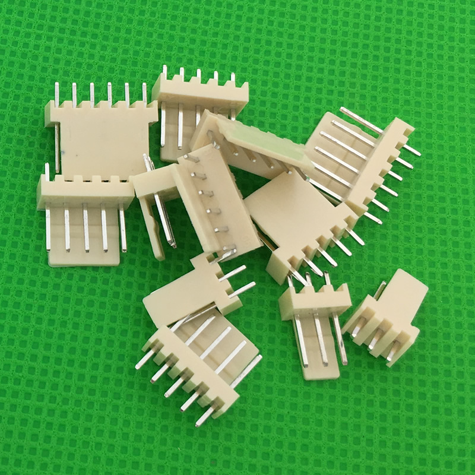
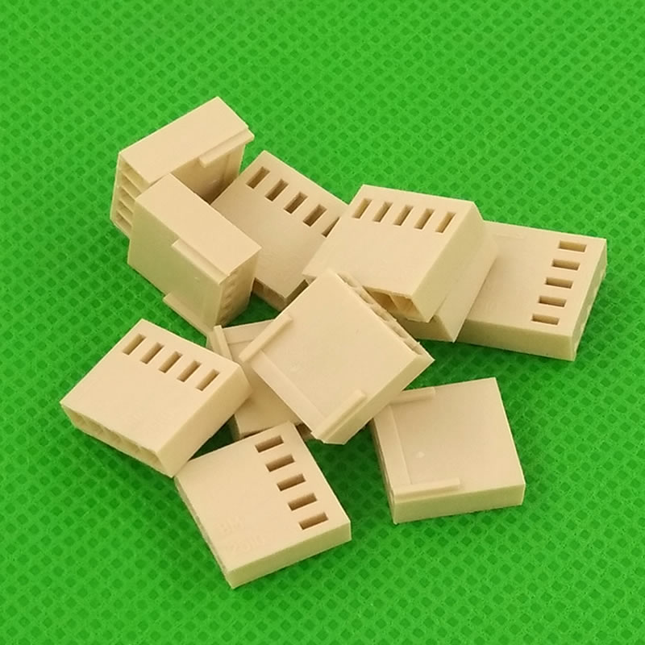
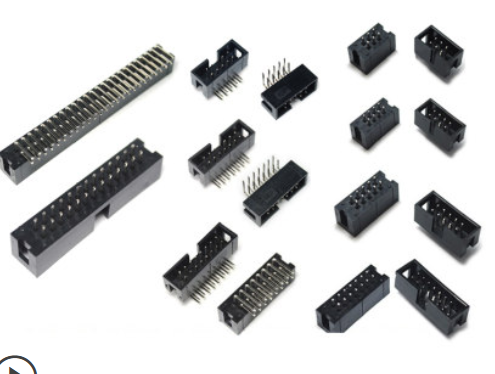
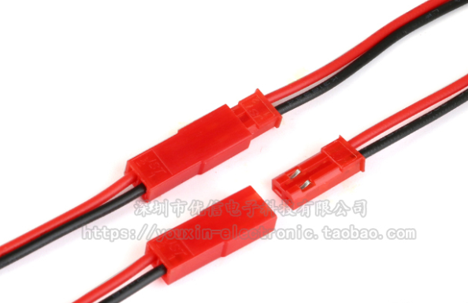

本文的主要是用来记录下，自己所用的的一些电路板上的端子，因为端子的类型实在是太多了，所以有笔记记录一下。

端子按连接形式分为：线对线 、线对板、板对板三种类型

## 线对板

### XH-2.54

电路板设计中最常用的一种端子就是 **XH-2.54**，这是一种引脚间距为 2.54mm 的端子。

#### 参数

* 额定电流：**3A**

**XH-2.54** 分为带卡扣和不带卡口两种类型

#### 不带锁（卡扣）端子（常用）

#### 带锁（卡扣）端子

#### 线对线

XH-2.54 有线对线方式的，可以用来作为快速插拔的连接方式。

### KF2510

首先这是一种**2.54mm**间距引脚的端子，针座分为直端子底座和弯端子底座，端子是通用的。一般的命名形式为：

* 端子胶壳 > KF2510-2Y
* 直端子底座 > KF2510-2A、KF2510-3A...
* 弯端子底座 > KF2510-2AW 或 KF2510-2AGW

### 牛角座（DC3)

牛角座也分为多种规格的，按引脚间距分为2.54、2.0、1.27。

## 线对线

线对线连接器有很多中，这是一种实现线与线之间实现快速插拔的连接器。

### JST连接器

