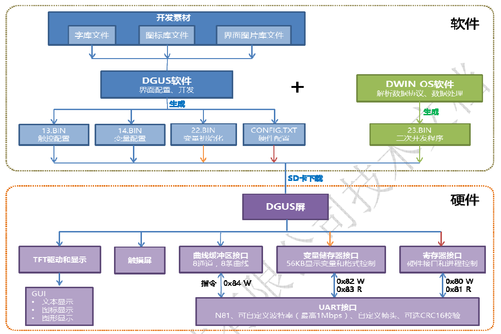

## DGUS 软件架构图

## 开发素材

1. 字库文件
2. 图标库文件
3. 界面图片文件

## DGUS软件界面配置、开发

* `13.BIN` 触控配置
* `14.BIN` 变量配置
* `22.BIN` 变量初始化
* `CONFIG.TXT` 硬件配置
* `23.BIN` 二次开发程序

## DGUS 屏硬件

* TFT驱动和显示
  * 文本显示
  * 图标显示
  * 图形显示
* 触摸屏
* 曲线缓冲区接口（8通道，8条曲线）0x84 W
* 变量存储器接口（56KB显示变量和格式控制）0x82 W 0x83 R
* 寄存器接口（硬件接口和进程控制）0x80 W 0x81 R

## DGUS 屏数据格式

DGUS屏使用的数据采用整数（字）、无符号整数（字）、长整数（双子）、超长整数（4个字）表示，相关表示范围如下：

整数：-32768（0x8000) 到 +32767(0x7FFF)

无符号整数：0（0x000) 到 +65535(0xFFFF)

长整数：-2147483648 (0x80000000) 到 +2147483647 (0x7FFFFFFF)

超长整数：-9223372036854775808 到 9223372036854775807

小数采用定点小数表示，用户自定义小数位，比如：0x4D2(1234), 规定小数位2位时，表示 12.34。

## 串口通信指令

数据帧结构：迪文DGUS屏的串口数据帧有4个数据块组成。

| 数据块   | 1                             | 2                            | 3         | 4    | 5                                  |
| -------- | ----------------------------- | ---------------------------- | --------- | ---- | ---------------------------------- |
| 定义     | 帧头                          | 数据长度                     | 指令      | 数据 | 指令和数据的CRC校验                |
| 数据长度 | 2                             | 1                            | 1         | N    | 2                                  |
| 说明     | CONFIG.TXT配置文件的R3:RA定义 | 数据长度包括指令、数据和校验 | 0x80~0x84 |      | CONFIG.TXT配置文件的R2决定是否启用 |

串口的所有指令或者数据都是16进制（HEX）格式，对于字型（2字节），总是采取高字节先传送（MSB)

* 寄存器：0x80(W) 0x81(R) - 以字节为数据单位
* 变量寄存器：0x82(W) 0x83(R) - 以字为数据单位
* 曲线缓冲区：0x84(W) - 以字为数据单位

