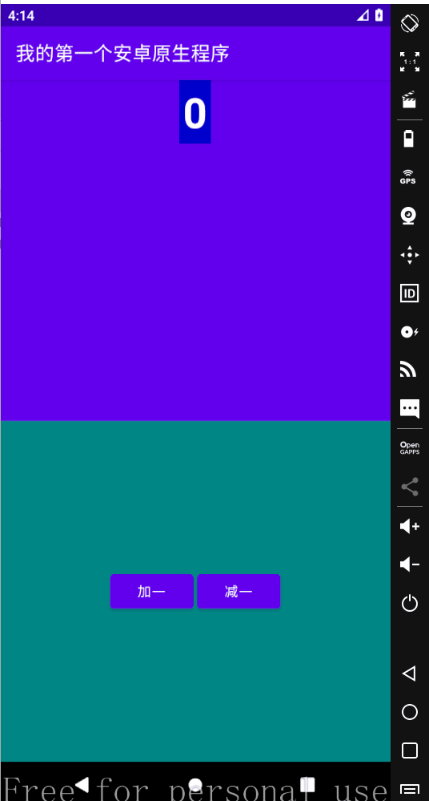

# Button 示例程序

## activity_main.xml

```xml
<?xml version="1.0" encoding="utf-8"?>
<LinearLayout xmlns:android="http://schemas.android.com/apk/res/android"
    xmlns:app="http://schemas.android.com/apk/res-auto"
    xmlns:tools="http://schemas.android.com/tools"
    android:layout_width="match_parent"
    android:layout_height="match_parent"
    android:orientation="vertical">

    <LinearLayout
        android:layout_width="match_parent"
        android:layout_height="0dp"
        android:layout_weight="1"
        android:background="@color/purple_500"
        android:orientation="vertical">
        <TextView
            android:id="@+id/text1"
            android:layout_width="wrap_content"
            android:layout_height="wrap_content"
            android:textSize="44dp"
            android:text="000"
            android:textColor="#fff"
            android:background="#00c"
            android:textStyle="bold"
            android:padding="4dp"
            android:layout_gravity="center"/>

    </LinearLayout>
    <RelativeLayout
        android:layout_width="match_parent"
        android:layout_height="0dp"
        android:layout_weight="1"
        android:background="@color/teal_700"
        >
        <LinearLayout
            android:layout_width="wrap_content"
            android:layout_height="wrap_content"
            android:layout_centerInParent="true">
            <Button
                android:id="@+id/btn1"
                android:layout_width="wrap_content"
                android:layout_height="wrap_content"
                android:text="@string/btn_add"
                android:onClick="btnAddOnClick"
                android:layout_centerInParent="true"
                android:layout_margin="2dp"
                />
            <Button
                android:id="@+id/btn2"
                android:layout_width="wrap_content"
                android:layout_height="wrap_content"
                android:text="@string/btn_subtract"
                android:onClick="btnSubtractOnClick"
                android:layout_centerInParent="true"
                android:layout_margin="2dp"
                />
        </LinearLayout>
    </RelativeLayout>
</LinearLayout>
```



## MainActivity.kt (v1.0)

```kotlin
package xin.z10.myapplication

import android.nfc.Tag
import androidx.appcompat.app.AppCompatActivity
import android.os.Bundle
import android.os.Debug
import android.util.Log
import android.view.View
import android.widget.TextView
import xin.z10.myapplication.R.layout.activity_main as activity_main1

class MainActivity : AppCompatActivity() {
    var num = 0;
    override fun onCreate(savedInstanceState: Bundle?) {
        super.onCreate(savedInstanceState)
        setContentView(activity_main1)
    }

    fun btnAddOnClick(view: View) {
        Log.v("加一按钮", "加一")
        var text1: TextView = findViewById<TextView>(R.id.text1)
        num++
        text1.text = num.toString()
    }
    fun btnSubtractOnClick(view: View){
        Log.v("减一按钮", "减一")
        num--
        var text1: TextView = findViewById<TextView>(R.id.text1)
        text1.text = num.toString()
    }
}
```

## MainActivity.kt (v1.1)

```kotlin
package xin.z10.myapplication

import android.nfc.Tag
import androidx.appcompat.app.AppCompatActivity
import android.os.Bundle
import android.os.Debug
import android.util.Log
import android.view.View
import android.widget.Button
import android.widget.TextView
import xin.z10.myapplication.R.layout.activity_main as activity_main1

class MainActivity : AppCompatActivity() {
    var num = 0;
    override fun onCreate(savedInstanceState: Bundle?) {
        super.onCreate(savedInstanceState)
        setContentView(activity_main1)
        var textNum: TextView = findViewById<TextView>(R.id.text1)

        var btnAdd = findViewById<Button>(R.id.btn1)
        btnAdd.setOnClickListener(View.OnClickListener {
            num++
            textNum.text = num.toString()
        })

        var btnSubtract = findViewById<Button>(R.id.btn2)
        btnSubtract.setOnClickListener(View.OnClickListener {
            num--
            textNum.text = num.toString()
        })
    }
}
```


## Java 方式的部分代码

```java
// 获取 Button
Button btnAdd = findViewById(R.id.btn1)
btnAdd.setOnClickListener(new View.OnClickListener(){
    @Override
    public void onClick(View v) {
        // 要执行的代码
    }
})

```


## 获取 TextView (Java)

```java
TextView textView = findViewById(R.id.text_view)
```

## 获取 TextView (Kotlin)

```kotlin
val textView : TextView = findViewById(R.id.text_view)
// 或
val textView = findViewById<TextView>(R.id.text_view)
```

## 设定 TextView 文本内容 (Java)

```java
textView.setText("word");
textView.setText(R.string.word);
```

## 设定 TextView 文本内容 (Kotlin)

```kotlin
textView.text = "world"
textView.text = getString(R.string.word)
```

