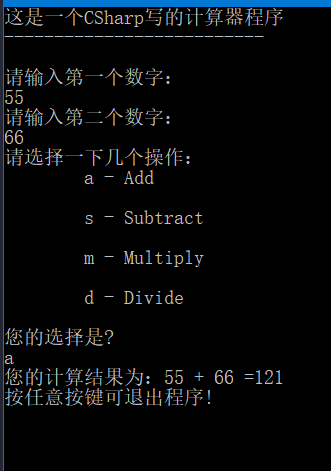

MicroSoft 官网 CSharp 教程 计算器程

## 基础版

```csharp
using System;

namespace Calculator
{
    class Program
    {
        static void Main(string[] args)
        {
            int num1 = 0;
            int num2 = 0;
            Console.WriteLine("这是一个CSharp写的计算器程序\r");
            Console.WriteLine("--------------------------\n");

            Console.WriteLine("请输入第一个数字：");
            num1 = Convert.ToInt32(Console.ReadLine());

            Console.WriteLine("请输入第二个数字：");
            num2 = Convert.ToInt32(Console.ReadLine());

            Console.WriteLine("请选择一下几个操作：");

            Console.WriteLine("\ta - Add\n");
            Console.WriteLine("\ts - Subtract\n");
            Console.WriteLine("\tm - Multiply\n");
            Console.WriteLine("\td - Divide\n");
            Console.WriteLine("您的选择是?");

            switch (Console.ReadLine())
            {
                case "a":
                    Console.WriteLine($"您的计算结果为：{num1} + {num2} =" + (num1 + num2));
                    break;
                case "s":
                    Console.WriteLine($"您的计算结果为：{num1} - {num2} =" + (num1 - num2));
                    break;
                case "m":
                    Console.WriteLine($"您的计算结果为：{num1} * {num2} =" + (num1 * num2));
                    break;
                case "d":
                    Console.WriteLine($"您的计算结果为：{num1} / {num2} =" + (num1 / num2));
                    break;
            }

            Console.WriteLine("按任意按键可退出程序!");
            Console.ReadKey();
        }
    }
}
```




## 改进版

```csharp
using System;

namespace Calculator
{
    class Calculator
    {
        public static double DoOperation(double num1, double num2, string op)
        {
            double result = Double.NaN;

            switch(op)
            {
                case "a":
                    result = num1 + num2;
                    break;
                case "s":
                    result = num1 - num2;
                    break;
                case "m":
                    result = num1 * num2;
                    break;
                case "d":
                    while (num2 != 0)
                    {
                        result = num1 / num2;
                    }
                    break;
                default:
                    break;
            }

            return result;
        }
    } /* Calculator Class END! */


    class Program
    {
        static void Main(string[] args)
        {
            bool endApp = false;
            Console.WriteLine("这是一个CSharp写的计算器程序\r");
            Console.WriteLine("--------------------------\n");


            while (!endApp)
            {
                string numInput1 = "";
                string numInput2 = "";
                double result = 0;

                Console.WriteLine("请输入第一个数字：");
                numInput1 = Console.ReadLine();

                double cleanNum1 = 0;
                while (!double.TryParse(numInput1, out cleanNum1))
                {
                    Console.WriteLine("输入类型错误，请输入数字类型");
                    numInput1 = Console.ReadLine();
                }

                Console.WriteLine("请输入第二个数字：");
                numInput2 = Console.ReadLine();

                double cleanNum2 = 0;
                while(!double.TryParse(numInput2, out cleanNum2))
                {
                    Console.WriteLine("输入类型错误，请输入数字类型");
                    numInput2 = Console.ReadLine();
                }

                Console.WriteLine("请选择一下几个操作：");

                Console.WriteLine("\ta - Add\n");
                Console.WriteLine("\ts - Subtract\n");
                Console.WriteLine("\tm - Multiply\n");
                Console.WriteLine("\td - Divide\n");
                Console.WriteLine("您的选择是?");

                string op = Console.ReadLine();

                try
                {
                    result = Calculator.DoOperation(cleanNum1, cleanNum2, op);
                    if(double.IsNaN(result))
                    {
                        Console.WriteLine("结果 NaN 错误");
                    } else
                    {
                        Console.WriteLine("You Result: {0:0.##}\n", result);
                    }
                } catch (Exception e)
                {
                    Console.WriteLine("计算结果时出现了一个错误");
                }

                Console.WriteLine("退出程序请按 'n' 键，继续运行按其他按键");
                if ("n" == Console.ReadLine()) endApp = true;

                Console.WriteLine("\n");

            } /* while (!endApp) END! */
            return;
        }
    } /* Program Class END! */
}

```

