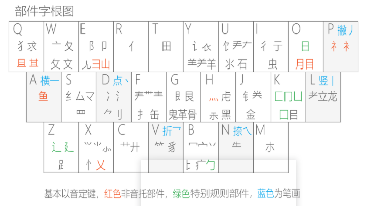
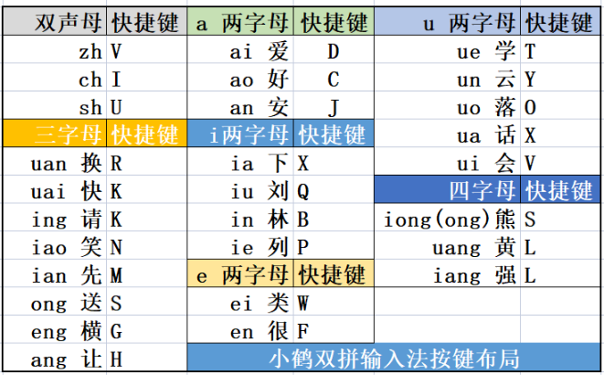

## 小鹤双拼

官网地址：

[小鹤双拼·小鹤音形 - 官方网站 (flypy.com)](https://flypy.com/) 

[小鹤学习指引 (flypy.com)](https://xh.flypy.com/#/)

## 双声母

| 声母 | 键位 |
| ---: | ---- |
| `zh` | V    |
| `ch` | I    |
| `sh` | U    |

## 两字母

| a 开头（两字母） | 键位 |
| ---------------: | ---- |
|          `ai` 爱 | D    |
|          `ao` 好 | C    |
|          `an` 安 | J    |

| u 开头（两字母） |      |
| ---------------: | ---- |
|          `ue` 学 | T    |
|          `un` 云 | Y    |
|          `uo` 落 | O    |
|          `ua` 话 | X    |
|          `ui` 会 | V    |

| e 开头（两字母） |      |
| ---------------: | ---- |
|          `ei` 类 | W    |
|          `en` 很 | F    |

| i 开头（两字母） |      |
| ---------------: | ---- |
|          `ia` 下 | X    |
|          `iu` 刘 | Q    |
|          `in` 林 | B    |
|          `ie` 列 | P    |

## 三字母

|   三字母 |      |
| -------: | ---- |
| `uan` 换 | R    |
| `uai` 快 | K    |
| `ing` 请 | K    |
| `iao` 笑 | N    |
| `ian` 先 | M    |
| `ong` 送 | S    |
| `eng` 横 | G    |
| `ang` 让 | H    |

## 四字母

|               四字母 |      |
| -------------------: | ---- |
|     `iong` （`ong`） | S    |
|  `uang` 黄（`iang`） | L    |
| `iang` 强 （`uang`） | L    |

